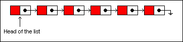
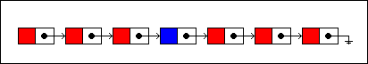
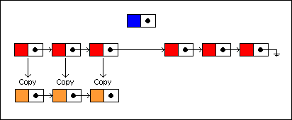
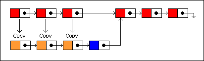

footer: Clojure Concurrency
slidenumbers: true
slidecount: true

# Clojure Concurrency

---

# Clojure

- A dialect of Lisp and a functional language
- Uses immutable **persistent data structures**
- Offers a **Software Transactional Memory** system and a reactive **Agent** system
- Implements Hoare's **CSP** and Dijkstra's **Guarded Commands**

---

## Avoid mutable variables

```clojure
(def hobbit-body-parts [{:name "head" :size 3}
                        {:name "eyes" :size 1}
                        {:name "mouth" :size 3}
                        {:name "arms" :size 3}
                        {:name "chest" :size 10}
                        {:name "feet" :size 2}])

(def size-sum (reduce + (map :size hobbit-body-parts)))

(def sum-to-10
  (loop [sum 0 x 0]
    (if (= x 11)
      sum
      (recur (+ sum x) (+ 1 x)))))

(println size-sum)
(println sum-to-10)
```

---

# Persistent data structures

```clojure
(def my-vector [1 2 3 4])
```
[1 2 3 4]

```clojure
(def new-vector (conj my-vector 5))
```
[1 2 3 4 5]

```clojure
(println my-vector)
```
[1 2 3 4]

---

## Persistent data structures

```clojure
(def a { :name "Red" })
(...)
(def my-list '(a b c d e f))
```



---

## Persistent data structures

```clojure
(defn insert-at
  [index xs x]
  (let [[before after] (split-at index xs)]
    (list (concat before x after))))

(def g { :name "Blue" })
(insert-at 3 my-list g)
```



---

## Persistent data structures



---

## Persistent data structures



---

# Atom, Ref and Agent

### Along with Future

---

# Atoms

- Implement Clojure's concept of state
- Allow to assign a new **value** to an **identity**
- **compare-and-set**

```clojure
(def count (atom 0))

(swap! count + 10)

(println @count)
```

=> 10

---

## Past state

```clojure
(let [num (atom 1) s1 @num]
  (swap! num inc)
  (println "State 1:" s1)
  (println "Current state:" @num))
````
=> State 1: 1
=> Current state: 2

^ Without locks/synchronized

---

# Future

```clojure
(def task
  (future
    (Thread/sleep 1000)
    "task"))

(println @task)
```

---

## Future and Atoms

```clojure
(defn quote-word-count
  [number-of-quotes]
  (let [word-count (atom 0)]
    (dotimes [n number-of-quotes]
      (let [req (future (slurp "https://www.braveclojure.com/random-quote"))]
        (swap! word-count + (count @req))))
    @word-count))

(quote-word-count 5)
```

---

# Refs

```clojure
(def counter (ref 0))
(def counter-transaction 
  (future
    (dosync
      (alter counter inc)
      (println @counter)
      (Thread/sleep 500)
      (alter counter inc)
      (println @counter))))
(Thread/sleep 250)
(println @counter)
```

=> 1
=> 0
=> 2

^ update the state of more than one identity simultaneously.

---

## Transaction

- **atomic**: all refs are updated or none of them are
- **consistent**: the refs always appear to have valid states
- **isolated**: transactions behave as if they executed serially

**ACI** D

^ Non rischia deadlock rispetto a Java synchronized
compare-and-set

---

# Software transactional memory

Bla bla bla.

---

# Channels

---

# Channels

- based on CSP by Hoare (1978)
- *put* and *take*

```clojure
(def c (chan))

(go
  (dotimes [n 5]
    (>! c (str n))
    (Thread/sleep (rand-int 1000))))

(dotimes [n 5]
  (println (<!! c)))
```

^ Used to communicate state
Thread pool
Invece di condividere stato, si usano channels

---

# Buffering

- *rendez-vous* by default

```clojure
(def echo-chan (chan 2))
(go (println (<! echo-chan)))
(>!! echo-chan "ketchup") ; Doesn't block
```

---

# As services

```clojure
(defn operator
  [name]
  (let [c (chan)]
    (go
      (dotimes [n 5]
        (>! c (str name ": " n))
        (Thread/sleep (rand-int 1000))))
    c))

(def joe (operator "Joe"))
(def ann (operator "Ann"))

(dotimes [n 5]
  (println (<!! joe))
  (println (<!! ann)))
```

^ First-class channels

---

# Multiplexing

```clojure
(defn multiplexing
  [c1 c2]
  (let [c (chan)]
    (go (while true (>! c (<! c1))))
    (go (while true (>! c (<! c2))))
    c))

(let [c (multiplexing joe ann)]
  (dotimes [n 10]
    (println (<!! c))))
```

---

# Guarded-commands

```clojure
(defn multiplexing
  [c1 c2]
  (let [c (chan)]
    (go (while true
          (let [[value channel] (alts! [c1 c2])]
            (>! c value))))
    c))
```

---

# Timeout

```clojure
(defn multiplexing
  [c1 c2]
  (let [c (chan)]
    (go (while true
          (let [[value channel] (alts! [c1 c2 (timeout 500)])]
            (>! c (if value value "Timeout")))))
    c))
```

---

# Guard conditions

```clojure
(alt!
  [c1 c2] ([val ch] (>!c val))
  timeout-ch "Timeout"
  :default 42)
```

---

# Honorable mentions

- *Delay* and *Promise*
- *core.reducers*

---

## References I

- [Clojure for the brave and true](https://www.braveclojure.com/)
- [Persistent data structures](https://en.wikipedia.org/wiki/Persistent_data_structure)
- [Identity and State](https://clojure.org/about/state)
- [Clojure dosync vs Java synchronized](https://stackoverflow.com/questions/3583513/clojure-stm-dosync-x-java-synchronize-block)
- [Mark Volkmann's Software Transactional Memory (STM)](http://java.ociweb.com/mark/stm/)
- [Concurrency via Software Transactional Memory](http://berb.github.io/diploma-thesis/community/053_stm.html)

---

## References II

- [Clojure Overview - Concurrent Programming](https://clojure.org/about/concurrent_programming)
- [Clojure core.async - Rich Hickey](https://www.infoq.com/presentations/clojure-core-async)
- [Go Concurrency Patterns - Rob Pike](https://www.youtube.com/watch?v=f6kdp27TYZs)
