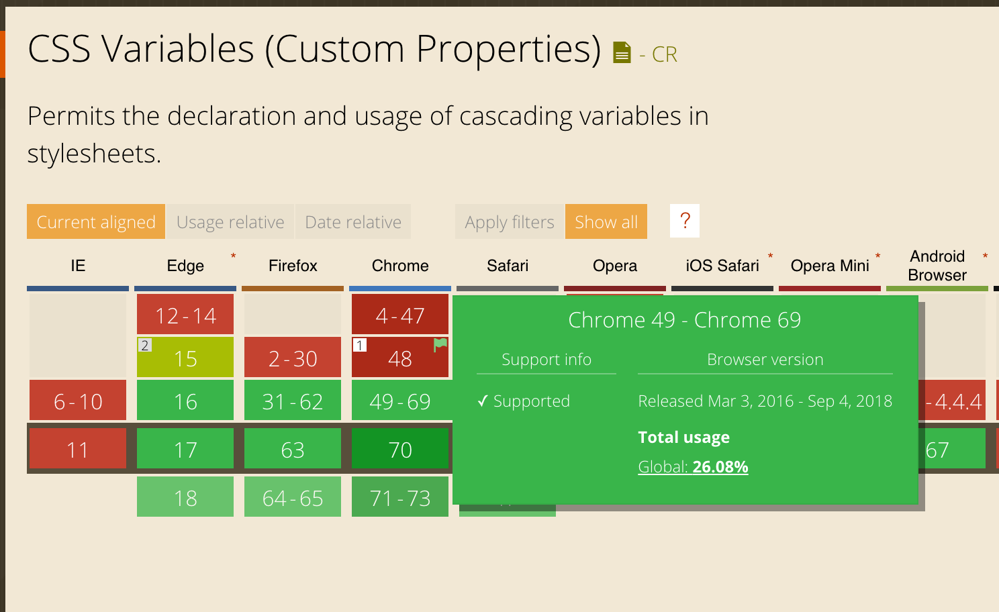
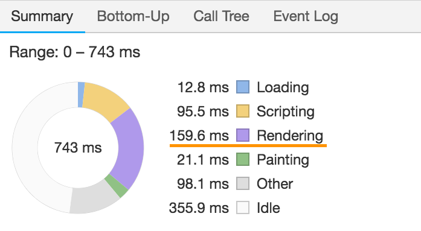
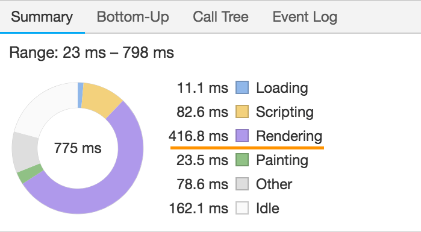
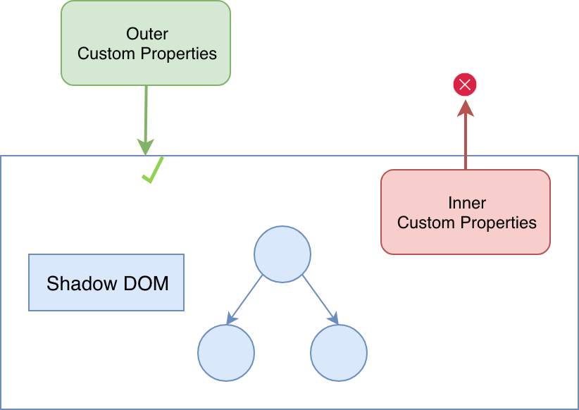
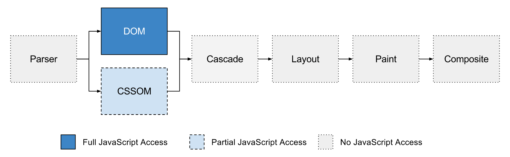
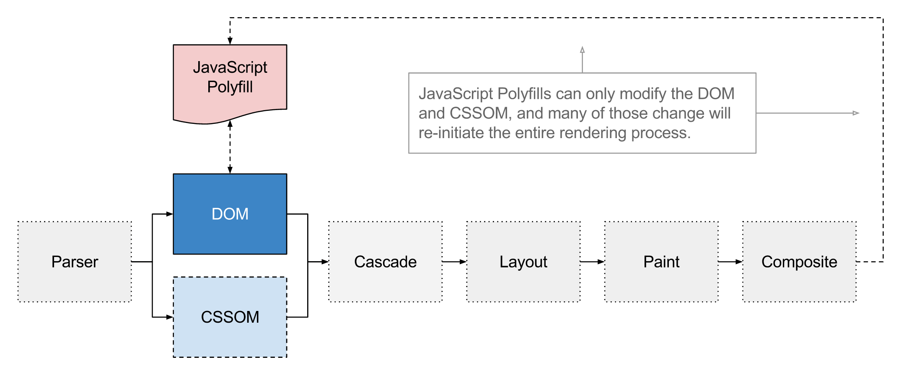
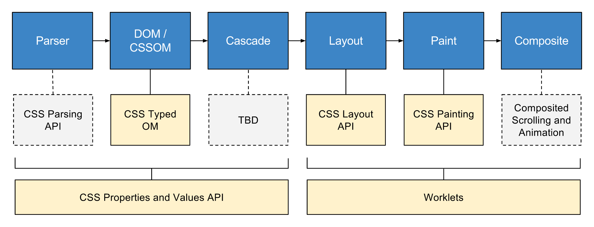

footer: CSS Renaissance - Milano Frontend
slidenumbers: true
slidecount: true

# CSS Renaissance


---

# From the Middle Age to modern CSS

- Custom Properties
- Shadow DOM
- Houdini (Paint API)

---

# Custom Properties

Runtime CSS *variables*

Or

Inherited user-defined *properties*

--- 

# Runtime CSS Variables

```css
:root {
  --primary: #007bff;
}

.btn-primary {
  color: var(--primary, deepskyblue);
}
```

^ Syntax to avoid ambiguity

--- 

# Runtime CSS Variables

[.code-highlight: 5, 6, 7]

```css
:root { --primary: #007bff; }

.btn-primary { color: var(--primary, deepskyblue); }

.btn-primary:hover {
  --primary: crimson;
}
```

---


---

# Inherited user-definied properties [^ref]

```css
/* CSS */
div > p { --primary: crimson; }
p { --primary: aqua; }

.c-block { background-color: var(--primary); }
```

```html
<!-- HTML -->
<div>
  <p class="c-block"></p>
</div>
```

[^ref]: [glazman: CSS Variables, why we drop the $foo notation](http://www.glazman.org/weblog/dotclear/index.php?post/2012/08/17/CSS-Variables%2C-why-we-drop-the-%24foo-notation)

---



^ In Firefox since 2014

---

[postcss-css-variables](https://github.com/MadLittleMods/postcss-css-variables)
[postcss-custom-properties](https://github.com/postcss/postcss-custom-properties)

```css
:root {
  --color: red;
}

h1 {
  color: var(--color);
}

/* becomes */

:root {
  --color: red;
}

h1 {
  color: red;
  color: var(--color);
}
```

^ Treats custom properties much like preprocessor variables
Can use only :root
Aims to provide a future-proof way of using a limited subset

---

# Comparison

```css
:root { --backgroundColor: red; }

.header { background-color: var(--backgroundColor, white); }

.header:hover { --backgroundColor: orange; }

.header.is-about-page { --backgroundColor: yellow; }
```

---

# postcss-custom-properties

```css
:root { --backgroundColor: red; }

.header {
  background-color: red;
  background-color: var(--backgroundColor, white);
}

.header:hover { --backgroundColor: orange; }

.header.is-about-page { --backgroundColor: yellow; }
```

---

# postcss-css-variables

preserve: 'computed'

```css
:root { --backgroundColor: red; }

.header {
  background-color: red;
  background-color: var(--backgroundColor, white);
}

.header:hover { background-color: orange; }

.header:hover { --backgroundColor: orange; }

.header.is-about-page { --backgroundColor: yellow; }
```

---

```css
:root { --width: 100px; }

@media (max-width: 1000px) {
	:root { --width: 200px; }
}

.box { width: var(--width); }
```

---

```css
:root {
  --width: 100px;
}

.box {
  width: 100px;
}

@media (max-width: 1000px) {
  .box {
    width: 200px;
  }
}

.box { width: var(--width); }

@media (max-width: 1000px) {
  :root {
    --width: 200px;
  }
}

```

---

# Stripping custom properties

If you can preprocess custom properties and get what you expect, stick with preprocessor variables.

- [postcss-simple-vars](https://github.com/postcss/postcss-simple-vars)

---

# Interoperability

- Sass/Less
- React/Angular/Vue
- hyperHTML
- styled-components
- [CSS-in-JS: linaria](https://github.com/callstack/linaria)

^ Anything since it's standard
Sass files cannot be used without Sass

---

Values can be any valid CSS value: numbers, strings, lengths, colors, etc.

```css
/* CSS */
:root {
  --foo: console.log('Hello world');
}
```

```js
// JS
const styles = window.getComputedStyle(document.documentElement);
const value = styles.getPropertyValue('--foo');
eval(value);
```

---

# i18n [^1]

```css
:root,
:root:lang(en) {
  --external-link: "external link";
}

:root:lang(de) {
  --external-link: "externer Link";
}

:root:lang(it) {
  --external-link: "Link esterno";
}

a[href^="http"]::after {content: " (" var(--external-link) ")"}
```

[^1]: [publishing-project.rivendellweb.net](https://publishing-project.rivendellweb.net/theming-the-web-with-css-custom-properties/)

---

# Operations

```css
:root {
  --columns: 12;
  --gutter: 16px;
}

.o-col {
  margin: 0 calc(var(--gutter) * 2);
  width: calc(100% / var(--columns));
}
```

---

# Operations

[.code-highlight: 4, 8]

```css
:root {
  --columns: 12;
  --gutter: 16px;
  --margin: (var(--gutter) * 2)
}

.o-col {
  margin: 0 calc(var(--margin));
}
```

^ You can think of these as simple textual replacements

---

# Operations

```css
:root {
  --alpha-hover: 0.04;
  --primary: 98, 0, 238;
}

.c-button:hover {
  background-color: rgba(var(--primary), var(--alpha-hover))
}
```

^ CSS4 color functions

---

# Operations

```css
:root {
  --animation-duration-simple: 0.1s;
  --easing-standard: cubic-bezier(0.4, 0.0, 0.2, 1);
}

.c-box {
  transition:
              all
              var(--animation-duration-medium)
              var(--easing-standard);
}
```

^ Primitives for design systems

---

# Separate logic from design

[Codepen](https://codepen.io/g12n/pen/ZLYqyr)

- All the logic at the top of the document
- See changing property

^ Without keeping track in mind of changing properties

---

# Custom properties in JS

```html
<button style={{ '--primary': colors.primary }}></button>
```

Vanilla JS

```javascript
const getVariable = (el, propertyName) => {
  const styles = window.getComputedStyle(el);
  
  return String(styles.getPropertyValue(propertyName)).trim();
};

const setDocumentVariable = (propertyName, value) => {
  document.documentElement.style.setProperty(propertyName, value);
};
```

^ Cannot get from el.style

---


---


[Codepen](https://codepen.io/jiayihu/pen/YReYLY)

---


---


[Codepen](https://codepen.io/tutsplus/pen/MmzNNQ)

^ Styling logic kept in CSS

---

# Complaints

1. Syntax is ugly and verbose
2. Sass/Less already have variables

---

# Preprocessor vs CSS Variables [^2]

- Sass variables are static and lexically scoped
- CSS variables are live and scoped to the DOM

[^2]: [philipwalton: Why I'm Excited About Native CSS Variables](https://philipwalton.com/articles/why-im-excited-about-native-css-variables/)

^ Custom properties fill a gap that preprocessor variables simply can’t.

---

# What preprocessor cannot do

1. Interact with Javascript or 3rd party stylesheets
2. Aware of the DOM or CSSOM
3. Be changed dynamically
4. Cascade
5. Inherit

^ There are also many things preprocessor can do.

---

# Responsive properties with media queries

```scss
$gutterSm: 1em;
$gutterMd: 2em;
$gutterLg: 3em;

.o-container {
  padding: $gutterSm;
}

@media (min-width: 30em) {
  .o-container {
    padding: $gutterMd;
  }
}

@media (min-width: 48em) {
  .o-container {
    padding: $gutterLg;
  }
}
```

---

# Responsive properties with media queries

```css
:root { --gutter: 1.5em; }

.o-container {
  padding: var(--gutter);
}

@media (min-width: 30em) {
  :root { --gutter: 2em; }
}
@media (min-width: 48em) {
  :root { --gutter: 3em; }
}
```

^ Like Excel cells

---

# Responsive modular scale

```css

:root {
  --base-font-size: 1em;
  --modular-scale: 1.2;
}
p { font-size: var(--base-font-size); }
h1 { font-size: calc(var(--modular-scale) * 3 * var(--base-font-size)); }
h2 { font-size: calc(var(--modular-scale) * 2 * var(--base-font-size)); }

@media (min-width: 30em) {
  :root { --modular-scale: 1.333 }
}
@media (min-width: 48em) {
  :root { --modular-scale: 1.414 }
}
```

---

# Reusable and extensible components

```html
<header class="header">
  <button class="c-button c-header-button"></button>
</header>
```

```css
.c-button {
  background-color: #eee;
  border: 2px solid crimson;
  color: crimson;
  font-size: 18px;
}

.c-header-button {
  background-color: #333;
  border: 2px solid aqua;
  color: aqua;
  font-size: 24px;
}

/* Or worse ... */
.header .c-button {}
```

^ Overriding HTML implementation details
We do it because the language has allowed us to see and change implementation details
Like changing variables in a function from outside

---

# Reusable and extensible components

```css
.c-button {
  --btn-bg-color: #eee;
  --btn-primary-color: crimson;
  --btn-font-size: 18px;

  background-color: var(--btn-bg-color);
  border: 2px solid var(--btn-primary-color);
  color: var(--btn-primary-color);
  font-size: var(--btn-font-size);
}

.c-header-button {
  --btn-bg-color: #333;
  --btn-primary-color: aqua;
  --btn-font-size: 24px;
}
```

^ Using only styling API

---

# Component styling API [^3]

API: Application programming interface [^4]

> “By abstracting the underlying implementation and only exposing objects or actions the developer needs, an API simplifies programming.”

[^3]: [mrmrs: Component styling API](http://mrmrs.cc/writing/2018/06/18/component-styling-api/)

[^4]: [Wikipedia - API](https://en.wikipedia.org/wiki/Application_programming_interface)

---

# Theming

> The act of laying a veneer over the top of an already styled website: an optional extra which alters or customises the UI

---

[.hide-footer]
[.slidenumbers: false]
[.slidecount: false]


---

[.hide-footer]
[.slidenumbers: false]
[.slidecount: false]


---

# Variant Theming

```html
<nav class="c-navigation c-news-navigation"></nav>
```

```css
/* Navigation.css */
:host {
  --navigation-bg: var(--primary)
}

.c-navigation {
  background-color: var(--navigation-bg);
}
```

```css
/* NewsNavigation.css */
.c-news-navigation {
  --navigation-bg: darkred;
}
```

---

# Static Theming

```css
/* settings.css */
:root {
  --main-color: #1b70de;
  --bg-color: #FFF;
  --text-color: #000;
  --button-color: rgba(0, 0, 0, 0.8);
  --header-color: #424242;
}

:root.dark {
  --main-color: darkblue;
  --bg-color: #333;
  --text-color: white;
  --button-color: black;
  --header-color: #333;
}
```

^ Without compiling two files
Components don't know about themes

---

[.hide-footer]
[.slidenumbers: false]
[.slidecount: false]


---

# User theme

```css
:root {
  --user-color: #01579B;
}

.u-textUserColor,
.u-borderUserColor {
  color: var(--user-color) !important;
}
```

---

# Theming with JS

```js
class App extends Component {
  constructor(props) {
    super(props);
    const theme = {
      '--main-color': '#1b70de',
      '--bg-color': '#FFF',
      '--text-color': '#000',
      '--button-color': 'rgba(0, 0, 0, 0.8)',
      '--header-color': '#424242',
    };
    this.state = { theme };
  }

  render() {
    return (
      <div>
        <RootCSSVariables variables={this.state.theme} />
        {...}
      </div>
    );
  }
}
```

^ Components are written with custom properties without knowing about themes
Also without style props or context

---

# Theming with JS

```js
class RootCSSVariables extends Component {
  componentDidMount() {  
    this.updateCSSVariables(this.props.variables);
  }

  componentDidUpdate(prevProps) {
    if (this.props.variables !== prevProps.variables) {     
      this.updateCSSVariables(this.props.variables);
    }
  }

  updateCSSVariables(variables) {   
    Object.keys(variables).forEach((key) => {
      const value = variables[key]
      document.documentElement.style.setProperty(key, value));
    });
  }

  render() { return this.props.children }
}
```

---

# Theming with Sass

```css
/* Navigation.css */
:host {
  /* --navigation-bg: var(--primary); */
  --navigation-bg: $primary;
}

.c-navigation {
  background-color: var(--navigation-bg, $primary);
}
```

---

# Theming with Sass

```css
/* Navigation.css */
:host {
  --navigation-bg: crimson;
}

.c-navigation {
  background-color: crimson;
  background-color: var(--navigation-bg, crimson);
}
```

---

 - [Encapsulation and theming - Maxart](https://maxart2501.github.io/css-theming-talk/)

---

# Runtime performance (25k nodes)

1. Start-up performance: _3x slower_
2. Style-recalculation: avoid frequent :root changes
3. Setting with JS
  - `el.setProperty('--color', 'green')` _4x slower_ than
  - `el.setProperty('color', 'green')`
4. _1.3x faster_ than inline styles

---

# Start-up performance



---

# Start-up performance [^5]



[^5]: [jiayihu: CSS Custom Properties performance in 2018](https://blog.jiayihu.net/css-custom-properties-performance-in-2018/)

---

# Recommendation

Use preprocessor for global static variables,
CSS custom properties for component styling API and theming.

^ Custom properties make sense with CSS properties that change relative to a condition in the DOM — especially a dynamic condition such as :focus, :hover, media queries or with JavaScript

---

# About Custom Properties

It's like when OOP was first invented.

^ Programming in CSS is like writing an app using only one JS file

---

# Shadow DOM

---

# Shadow DOM

- Part of Web Components
- Used by native DOM elements
- Similar to `iframe`

---

[.background-color: #FFFFFF]
[.hide-footer]
[.slidenumbers: false]
[.slidecount: false]


---

- A boundary between the developer and the browser implementation

```html
<input id="foo" type="range">
```

- <video>, <select> etc.

---

```js
const hostEl = document.querySelector('.host');

const shadowRoot = hostEl.attachShadow({ mode: 'open' });
shadowRoot.innerHTML = `
  <style>
    p { 
      color: red;
    }
  </style>

  <p>Element with Shadow DOM</p>
`;
```

[Codepen](https://codepen.io/jiayihu/pen/vQWyGB?editors=1111)

^ You create a scoped DOM tree that's attached to the element, but separate from its actual children

---

```html
<c-button class="c-header-button"></c-button>
```

```css
.c-header-button {
  --btn-bg-color: #333;
  --btn-primary-color: aqua;
  --btn-font-size: 24px;
}
```

---

```html
<c-navigation class="c-news-navigation"></c-navigation>
```

```css
/* NewsNavigation.css */
.c-news-navigation {
  --navigation-bg: darkred;
}
```

---

```js
const styles = `:host { background-color: ${props.theme} }`;

return (
    <ShadowDOM>
      <style>{styles}</style>
      <div>
        <h1>Calendar for {props.date}</h1>
      </div>
    </ShadowDOM>
);
```

[ReactShadow](https://github.com/Wildhoney/ReactShadow)

---

# Encapsulation

> Encapsulation is used to hide the values or state of a structured data object inside a class, preventing unauthorized parties direct access to them.

> Publicly accessible methods are generally provided in the class.

---

# Encapsulation

- Isolated DOM
- Re-targeted events
- Scoped CSS
- Simplify CSS selectors

^ Isolated DOM: A component's DOM is self-contained (e.g. document.querySelector() won't return nodes in the component's shadow DOM).
Scoped CSS: CSS defined inside shadow DOM is scoped to it. Style rules don't leak out and page styles don't bleed in.
Simplifies CSS - Scoped DOM means you can use simple CSS selectors, more generic id/class names, and not worry about naming conflicts.

---

# New selectors

```css
:host {
  --navigation-bg: var(--primary);

  all: initial;
}

:host([disabled]) {
  pointer-events: none;
  opacity: 0.4;
}

:host-context(.dark-theme) {
  background-color: black;
}
```

^ Rules in the parent page have higher specificity than :host

---

# CSS Containment

```css
:host {
  contain: none | strict | content | [ size || layout || style || paint ];
}

:host {
  contain: content;
}
```

^ size: the element can be sized without the need to examine its dependents for size changes.
layout: nothing outside the element may affect its internal layout and vice versa (display: flex o left)
style: effects don't escape the containing element (counter-increment)
paint: descendants of the element don't display outside its bounds

---

[.header: #6C8EBF]
[.background-color: #FFFFFF]
[.hide-footer]
[.slidenumbers: false]
[.slidecount: false]

# With Custom Properties?



---

# vjeux CSS-in-JS

1. Global namespace
2. Dependencies
3. Dead code
4. Minification
5. Sharing constants
6. Non-deterministic resolution
7. Breaking isolation

---

# vjeux CSS-in-JS

1. Global namespace => **Shadow DOM**
2. Dependencies  => **Shadow DOM**
3. Dead code => **Shadow DOM**
4. Minification => **Shadow DOM (?)**
5. Sharing constants => **Custom Properties**
6. Non-deterministic resolution => **Shadow DOM (?)**
7. Breaking isolation => **Shadow DOM**

---

# Dependencies

With [postcss-import](https://github.com/postcss/postcss-import)

```css
@import "normalize";
@import "local/button.css";

.c-promo-button {
  background: rebeccapurple;
}
```

---

# Dead-code elimination

```css
.c-promo-button {
  background: rebeccapurple;
}
```

---

# Minification

[CSS-Blocks](https://github.com/linkedin/css-blocks) => [OptiCSS](https://github.com/linkedin/opticss)

```css
.c-promo-button {
  background: rebeccapurple;
}

/* into */

.f {
  background: rebeccapurple;
}
```

^ No need to keep track of other components minification

---

# Static analysis

No runtime cost for
  - dead-code elimination
  - minification

---

# Sharing constants

```css
.c-button {
  padding: var(--button-padding);
}
```

```js
render() {
  const buttonPadding = 10
  return (
    <button
      className="c-button"
      style={{ '--button-padding': buttonPadding }}
    ></button>
  )
}
```

^ Example: autoresizing button

---

# CSS Houdini

---

# CSS Houdini

- API to extend CSS itself
- Hook into CSS rendering engine
- In JS things move too fast, in CSS too slow

---

[.background-color: #FFFFFF]
[.hide-footer]
[.slidenumbers: false]
[.slidecount: false]



---

[.background-color: #FFFFFF]
[.hide-footer]
[.slidenumbers: false]
[.slidecount: false]



---

# Houdini

- Performant CSS polyfills
- Normalized CSS

---

# CSS Polyfills [^6]

- Polyfilling CSS is incredibly hard
- CSSOM discards any CSS rule it doesn’t understand

^  a polyfill is code that implements a feature on web browsers that do not support it

[^6]: [smashingmagazine](https://www.smashingmagazine.com/2016/03/houdini-maybe-the-most-exciting-development-in-css-youve-never-heard-of/)

---

[.background-color: #FFFFFF]
[.hide-footer]
[.slidenumbers: false]
[.slidecount: false]



---

# CSS Properties and Values API

```js
CSS.registerProperty({
    name: "--stop-color",
    syntax: "<color>",
    inherits: false,
    initialValue: "rgba(0,0,0,0)"
});
```

```css
.button {
  --stop-color: red;
  background: linear-gradient(var(--stop-color), black);
  transition: --stop-color 1s;
}


.button:hover {
  --stop-color: green;
}
```

---

# CSS Object Model (CSSOM)

- Like DOM, but for CSS

```html
<style>
  body { background-color: red; }
</style>
```

```js
const stylesheet = document.styleSheets[0];
stylesheet.cssRules[0].style.backgroundColor = "blue";
```

---

# CSS Object Model (CSSOM)

```javascript
const getVariable = (el, propertyName) => {
  const styles = window.getComputedStyle(el);
  
  return String(styles.getPropertyValue(propertyName)).trim();
};

const setDocumentVariable = (propertyName, value) => {
  document.documentElement.style.setProperty(propertyName, value);
};
```

---

# CSS Object Model (CSSOM)

[.code-highlight: 1, 2]

```js
const el = $('#someDiv').style.height;
el.style.height += 10;

el.style.height = `${Number(el.style.height) + 10}px`;
```

---

# CSS Object Model (CSSOM)

[.code-highlight: 4]

```js
const el = $('#someDiv').style.height += 10;
el.style.height += 10;

el.style.height = `${Number(el.style.height) + 10}px`;
```

---

# CSS Typed OM

```js
el.attributeStyleMap.set('height', CSS.px(42));
const height = el.attributeStyleMap.get('height');
console.log(height.value, height.unit); // 42, 'px'

el.attributeStyleMap.has('opacity') // false
el.attributeStyleMap.delete('height')
el.attributeStyleMap.clear();
```

^ Instead of strings, values are exposed as JavaScript objects to facilitate manipulation.
Map-like objects

---

# Why CSS Typed OM

- Fewer bugs
- Math operations and conversions
- Better performance (`requestAnimationFrame`)

---

# CSS Layout API

- Custom layout logic

```css
body {
  display: layout('masonry');
}
```

---

# CSS Layout API

```js
registerLayout('masonry', class {
  static get inputProperties() {
    return ['width', 'height']
  }

  static get childrenInputProperties() {
    return ['x', 'y', 'position']
  }

  *layout(children, edges, constraints, styleMap) {
    // Layout logic goes here.
  }
}
```

---

# Worklets

- Like Workers but for rendering
- Indipendent from main thread
- No access to DOM, Network etc.
- Lifetime is not defined

```js
if ('layoutWorklet' in CSS) {
  CSS.layoutWorklet.addModule('masonry.js');
}
```

---

# CSS Paint API

- Custom behaviour anywhere a CSS image is expected
- `background-image`, `border-image`, `linear-gradient`
- anything that can accept `url()`


```css
.bubble {
  --circle-color: blue;
  background-image: url("circle.png");
  background-image: paint('circle');
}
```

---

# CSS Paint API [^7]

```js
registerPaint('circle', class {
  static get inputProperties() { return ['--circle-color']; }
  
  paint(ctx, size, properties) {
    const color = properties.get('--circle-color');
    ctx.fillStyle = color;

    const x = size.width / 2;
    const y = size.height / 2;
    const radius = Math.min(x, y);

    ctx.beginPath();
    ctx.arc(x, y, radius, 0, 2 * Math.PI, false);
    ctx.fill();
  }
});
```

^ ctx: CanvasRenderingContext2D
style: computed Typed-OM style map of only listed inputProperties

---

# PaintRenderingContext2D

- A subset of the CanvasRenderingContext2D API
- No `CanvasImageData`, `CanvasText`
- [spec](https://www.w3.org/TR/css-paint-api-1/#2d-rendering-context)

^ For performance reasons
With the current API surface you can record all of the canvas commands, and play them back when you need to raster

---

# Use cases

- Lighter and more performant implementation (ripple)
- Dynamic background
- Polyfill for CSS features like _conic gradients_

---

# Demos

- Circle in textarea
- Ripple
- QRCode
- [css-houdini.rocks](https://css-houdini.rocks/conic-gradient)

---

# Paint API vs pure Canvas

- [OffscreenCanvas](https://developers.google.com/web/updates/2018/08/offscreen-canvas)
- Paint API is
  - reactive
  - lazy
  - auto-sized

---

- [Is Houdini ready yet‽](https://ishoudinireadyyet.com/)
- [houdini.glitch.me](https://houdini.glitch.me/)

---

# Always bet on standards

^ CSS variables can be introduced in existing Sass codebase

---

One last slide...

---

# Jiayi Hu

## [dʒʌɪ]

Front-end developer

- jiayi.ghu@gmail.com
- Twitter: [@jiayi_ghu](https://twitter.com/jiayi_ghu)
- GitHub: [jiayihu/talks](https://github.com/jiayihu//talks)
- italiajs.slack.com

---


