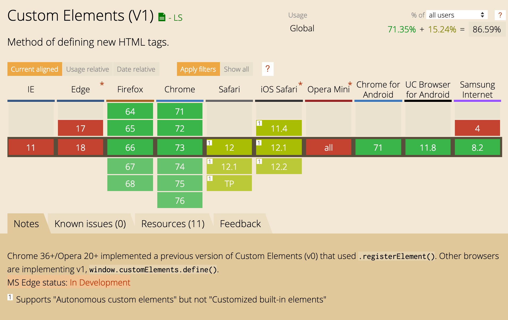
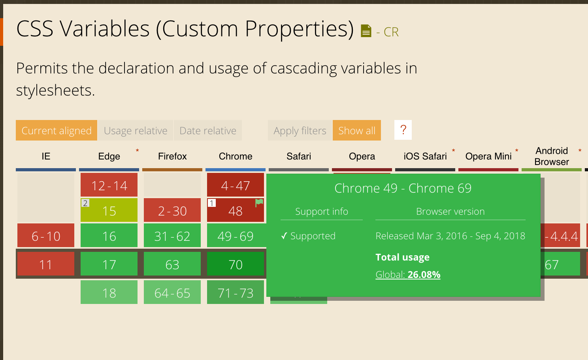
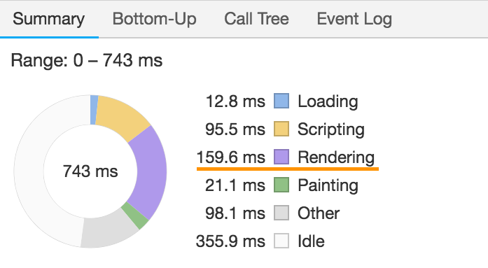
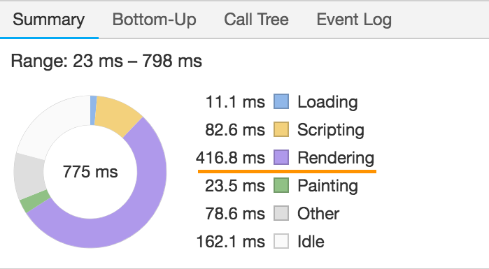

footer: Get hyper-excited for web standards - FEVR
slidenumbers: true
slidecount: true

# Get hyper-excited for web standards

---

1. Web Components
2. Custom Elements
3. HyperHTML
4. CSS Custom Properties
5. Shadow DOM

---

# Web Components

---

```html
<video controls src="video.mp4"></video>

<select>
  <option>Option 1</option>
  <option>Option 2</option>
  <option>Option 3</option>
</select>

<input type="date">
<input type="range">
```

---

```html
<div class="dropdown">
  <button class="btn btn-secondary dropdown-toggle">
    Dropdown button
  </button>
  <div class="dropdown-menu">
    <a class="dropdown-item" href="#">Action</a>
    <a class="dropdown-item" href="#">Another action</a>
    <a class="dropdown-item" href="#">Something else here</a>
  </div>
</div>
```

---

... *suspense*

---


---

```html
<tabs>
  <pane title="Hello">Hello</pane>
  <pane title="World">World</pane>
</tabs>
```

---


^ First class UI
First class functions - Node and FP

---

# What if want

- Truly reusable components
- Interoperability

---

# Web Components

1. Custom Elements
2. HTML Templates
3. Shadow DOM

---

# Custom Elements

Create new HTML tags

```html
<c-clock></c-clock>
```

[Codepen](https://codepen.io/jiayihu/pen/vQVWNZ?editors=1010)

---

```js
const template = document.createElement('template')
template.innerHTML = `
  <div>
      <h1>Hello, world!</h1>
      <h2>It is <span class="time"></span>.</h2>
  </div>
`

class Clock extends HTMLElement {
  constructor() {
    super();
    
    this.appendChild(template.content.cloneNode(true))
    this.timeEl = this.querySelector('.time')
  }
  
  connectedCallback() {
    this.token = window.setInterval(() => {
      this.timeEl.textContent = new Date().toLocaleTimeString();
    }, 1000)
  }
  
  disconnectedCallback() {
    if (this.token) window.clearInterval(this.token);
  }
}

customElements.define('c-clock', Clock)
```

^ - use the class to create a public JavaScript API for your tag
- any properties/methods become part of the element's DOM interface

---

# Tic-tac-toe XO


[in React](https://codepen.io/gaearon/pen/gWWZgR?editors=0110)

---

```html
<c-square value="X"></c-square>
```

```js
const template = document.createElement('template')
template.innerHTML = `<button class="square"></button>`

class Square extends HTMLElement {
  static get observedAttributes() {
    return ['value']
  }
  
  get value() { return this.getAttribute('value') }
  set value(val) { this.setAttribute('value', val) }
  
  constructor() {
    super();
    
    this.appendChild(template.content.cloneNode(true))
    this.btnEl = this.querySelector('.square')
  }
  
  attributeChangedCallback(attr, old, curr) {
    if (attr === 'value') this.btnEl.textContent = curr;
  }
}

customElements.define('c-square', Square)
```

^
- Reflecting properties to attributes
- keep the element's DOM representation in sync with its JavaScript state

---

# Enter hyperHTML & HyperHTMLElement

```js
class Square extends HyperHTMLElement {
  static get observedAttributes() {
    return ['value']
  }
  
  render() {
    return this.html`
      <button class="square">
        ${this.value}
      </button>
    `
  }
}

Square.define('c-square')
```

---

# hyperHTML

```js
function tick(render) {
  render`
    <div>
      <h1>Hello, world!</h1>
      <h2>It is ${new Date().toLocaleTimeString()}.</h2>
    </div>
  `;
}

setInterval(tick, 1000,
  hyperHTML.bind(document.body)
);
```

[Codepen](https://codepen.io/jiayihu/pen/EOdLMp)

---

# hyperHTML

- Declarative and reactive templates
- Cross-platform IE9+
- Lightweight 4kB
- Based on ES6 template literals

---

# Template literals

```js
function template(chunks, ...interpolations) {
  console.log(chunks);          // ['1 ', ' 3']
  console.log(interpolations);  // [2] or [4]
}
 
template`1 ${2} 3`;
template`1 ${4} 3`;
```

---

# Efficient DOM

```js
const bodyRender = hyperHTML.bind(document.body);
const names = [
  { name: 'First item' },
  { name: 'Second item' },
  { name: 'Third item' }
]
 
hyperHTML.bind(document.body)`
  <h1>${document.title}</h1>
  <ul>
    ${names.map(item => wire(item)`<li>${item.name}</li>`)}
  </ul>
`;
```

---

# Levenshtein algorithm


[domdiff](https://github.com/WebReflection/domdiff) based on [petit-dom](https://github.com/yelouafi/petit-dom)

---

# Faster than React?


^ React overhead on mobile and large trees

---

# Declarative template

```js
	
hyperHTML.bind(form)`
  <input
    class=${['one', 'more', 'class'].join(' ')}
    disabled=${!isAuthorized}
    oninput=${e => document.title = e.target.value}
    value=${defaultInputValue}
    placeholder=${'type something'}
    style=${{ color: 'red' }}
  >
`;
```

^ addEventListener behind the scenes

---

# Not primitive types [^codepen-obj]

```js
customElements.define('h-welcome', class HyperWelcome extends HTMLElement {
    constructor(...args) {
      super(...args);
      this.html = hyperHTML.bind(this);
    }

    get user() { return this._user; }
    set user(value) {
      this._user = value;
      this.render();
    }

    render() { return this.html`<h1>Hello, ${this._user.name}</h1>`; }
  }
);

hyperHTML.bind(document.getElementById('root'))`
  <h-welcome user=${{ name: 'Sara' }} />
  <h-welcome user=${{ name: 'Cahal' }} />
`;
```

[^codepen-obj]: [Codepen](https://codepen.io/jiayihu/pen/QVqNGJ?editors=0010)

---

# HyperHTMLElement [^github]

```js
class Game extends HyperHTMLElement {
  get defaultState() {
    return { history: [], stepNumber: 0 };
  }
  
  handleClick(event) {
    this.setState({ ... })
  }
  
  render() {
    const history = this.state.history;
    const current = history[this.state.stepNumber];

    return this.html`
      <div class="game-board">
        <c-board
          squares=${current.squares}
          onboardclick=${i => this.handleClick(i)}
        />
      </div>
    `;
  }
}

Game.define('c-game');
```

[^github]: [hyperHTML-Element](https://github.com/WebReflection/hyperHTML-Element)

---

```js
class Square extends HyperHTMLElement {
  static get observedAttributes() {
    return ['value']
  }

  static get booleanAttributes() {
    return ['disabled']
  }
  
  attributeChangedCallback() {
    this.render();
  }
  
  render() {
    return this.html`<button class="square">${this.value}</button>`
  }
}
Square.define('c-square')
```

---

# SSR

[viperHTML](https://viperhtml.js.org/viper.html)


---

# hyperHTML vs lit-html vs omi

[vs lit-html](https://gist.github.com/WebReflection/fadcc419f5ccaae92bc167d8ff5c611b)

[Tencent/omi](https://github.com/Tencent/omi)

---

# Custom Elements support



[webcomponentsjs](https://github.com/webcomponents/webcomponentsjs)
[WebReflection/document-register-element](https://github.com/WebReflection/document-register-element)

---

# Custom Elements in React


[custom-elements-everywhere](https://custom-elements-everywhere.com/)
[Web Components in React](https://reactjs.org/docs/web-components.html)

---

# Use cases for Custom Elements and hyperHTML

- UI components and libraries
  - [Primer - Github](https://primer.style/)
  - [Vaadin](https://vaadin.com/components/)
- Third-party widgets
- Lightweight **framework-less** **compiler-less** development

^ Assembler vs C
JSX vs template literals

---

# Custom Properties

---

# Custom Properties

Runtime CSS *variables*

Or

Inherited user-defined *properties*

--- 

# Runtime CSS Variables

```css
:root { --primary: #007bff; }

.btn-primary { color: var(--primary, deepskyblue); }

.btn-primary:hover {
  --primary: crimson;
}
```

---


---

# Inherited user-defined properties [^ref]

```css
/* CSS */
div > p { --primary: crimson; }
p { --primary: aqua; }

.c-block { background-color: var(--primary); }
```

```html
<!-- HTML -->
<div>
  <p class="c-block"></p>
</div>
```

[^ref]: [glazman: CSS Variables, why we drop the $foo notation](http://www.glazman.org/weblog/dotclear/index.php?post/2012/08/17/CSS-Variables%2C-why-we-drop-the-%24foo-notation)

---



^ In Firefox since 2014

---

[postcss-css-variables](https://github.com/MadLittleMods/postcss-css-variables)
[postcss-custom-properties](https://github.com/postcss/postcss-custom-properties)

```css
:root {
  --color: red;
}

h1 {
  --background: midnightblue;
  color: var(--color);
  background-color: var(--background);
}

/* becomes */

:root {
  --color: red;
}

h1 {
  color: red;
  color: var(--color);

  --background: midnightblue;
  background-color: var(--background);
}
```

^ Treats custom properties much like preprocessor variables
Can use only :root
Aims to provide a future-proof way of using a limited subset

---

# Interoperability

- Sass/Less
- React/Angular/Vue
- hyperHTML
- styled-components
- [CSS-in-JS: linaria](https://github.com/callstack/linaria)

^ Anything since it's standard
Sass files cannot be used without Sass

---

# Operations

```css
:root {
  --columns: 12;
  --gutter: 16px;
}

.o-col {
  margin: 0 calc(var(--gutter) * 2);
  width: calc(100% / var(--columns));
}
```

---

# Operations

```css
:root {
  --alpha-hover: 0.04;
  --primary: 98, 0, 238;
}

.c-button:hover {
  background-color: rgba(var(--primary), var(--alpha-hover))
}
```

^ CSS4 color functions

---

# Operations

```css
:root {
  --animation-duration-simple: 0.1s;
  --easing-standard: cubic-bezier(0.4, 0.0, 0.2, 1);
}

.c-box {
  transition:
              all
              var(--animation-duration-medium)
              var(--easing-standard);
}
```

^ Primitives for design systems

---

# Separate logic from design

[Codepen](https://codepen.io/g12n/pen/ZLYqyr)

- All the logic at the top of the document
- See changing property

^ Without keeping track in mind of changing properties

---

# Custom properties in JS

```html
<button style={{ '--primary': colors.primary }}></button>
```

Vanilla JS

```javascript
const getVariable = (el, propertyName) => {
  const styles = window.getComputedStyle(el);
  
  return String(styles.getPropertyValue(propertyName)).trim();
};

const setDocumentVariable = (propertyName, value) => {
  document.documentElement.style.setProperty(propertyName, value);
};
```

^ Cannot get from el.style

---


---


[Codepen](https://codepen.io/jiayihu/pen/YReYLY)

---


---


[Codepen](https://codepen.io/tutsplus/pen/MmzNNQ)

^ Styling logic kept in CSS

---

# Complaints

1. Syntax is ugly and verbose
2. Sass/Less already have variables

---

# Preprocessor vs CSS Variables [^2]

- Sass variables are static and lexically scoped
- CSS variables are live and scoped to the DOM

[^2]: [philipwalton: Why I'm Excited About Native CSS Variables](https://philipwalton.com/articles/why-im-excited-about-native-css-variables/)

^ Custom properties fill a gap that preprocessor variables simply can’t.

---

# What preprocessor cannot do

1. Interact with Javascript or 3rd party stylesheets
2. Aware of the DOM or CSSOM
3. Be changed dynamically
4. Cascade
5. Inherit

^ There are also many things preprocessor can do.

---

# Responsive properties with media queries

```scss
$gutterSm: 1em;
$gutterMd: 2em;
$gutterLg: 3em;

.o-container {
  padding: $gutterSm;
}

@media (min-width: 30em) {
  .o-container {
    padding: $gutterMd;
  }
}

@media (min-width: 48em) {
  .o-container {
    padding: $gutterLg;
  }
}
```

---

# Responsive properties with media queries

```css
:root { --gutter: 1.5em; }

.o-container {
  padding: var(--gutter);
}

@media (min-width: 30em) {
  :root { --gutter: 2em; }
}
@media (min-width: 48em) {
  :root { --gutter: 3em; }
}
```

^ Like Excel cells

---

# Reusable and extensible components

```html
<header class="header">
  <button class="c-button c-header-button"></button>
</header>
```

```css
.c-button {
  background-color: #eee;
  border: 2px solid crimson;
  color: crimson;
  font-size: 18px;
}

.c-header-button {
  background-color: #333;
  border: 2px solid aqua;
  color: aqua;
  font-size: 24px;
}

/* Or worse ... */
.header .c-button {}
```

^ Overriding HTML implementation details
We do it because the language has allowed us to see and change implementation details
Like changing variables in a function from outside

---

# Reusable and extensible components

```css
.c-button {
  --btn-bg-color: #eee;
  --btn-primary-color: crimson;
  --btn-font-size: 18px;

  background-color: var(--btn-bg-color);
  border: 2px solid var(--btn-primary-color);
  color: var(--btn-primary-color);
  font-size: var(--btn-font-size);
}

.c-header-button {
  --btn-bg-color: #333;
  --btn-primary-color: aqua;
  --btn-font-size: 24px;
}
```

^ Using only styling API

---

# Component styling API [^3]

API: Application programming interface [^4]

> “By abstracting the underlying implementation and only exposing objects or actions the developer needs, an API simplifies programming.”

[^3]: [mrmrs: Component styling API](http://mrmrs.cc/writing/2018/06/18/component-styling-api/)

[^4]: [Wikipedia - API](https://en.wikipedia.org/wiki/Application_programming_interface)

---

# Theming

> The act of laying a veneer over the top of an already styled website: an optional extra which alters or customises the UI

---

# Static Theming

```css
/* settings.css */
:root {
  --main-color: #1b70de;
  --bg-color: #FFF;
  --text-color: #000;
  --button-color: rgba(0, 0, 0, 0.8);
  --header-color: #424242;
}

:root.dark {
  --main-color: darkblue;
  --bg-color: #333;
  --text-color: white;
  --button-color: black;
  --header-color: #333;
}
```

^ Without compiling two files
Components don't know about themes

---

# Theming with Sass

```css
/* Navigation.css */
:host {
  /* --navigation-bg: var(--primary); */
  --navigation-bg: $primary;
}

.c-navigation {
  background-color: var(--navigation-bg, $primary);
}
```

---

[Encapsulation and theming - Maxart](https://maxart2501.github.io/css-theming-talk/)

---

# Start-up performance



---

# Start-up performance [^5]



[^5]: [jiayihu: CSS Custom Properties performance in 2018](https://blog.jiayihu.net/css-custom-properties-performance-in-2018/)

---

# Recommendation

Use preprocessor for global static variables,
CSS custom properties for component styling API and theming.

^ Custom properties make sense with CSS properties that change relative to a condition in the DOM — especially a dynamic condition such as :focus, :hover, media queries or with JavaScript

---

# About Custom Properties

It's like when OOP was first invented.

^ Programming in CSS is like writing an app using only one JS file

---

# Shadow DOM

---

# Shadow DOM

- Part of Web Components
- Used by native DOM elements
- Similar to `iframe`

---

[.background-color: #FFFFFF]
[.hide-footer]
[.slidenumbers: false]
[.slidecount: false]


---

- A boundary between the developer and the browser implementation

```html
<input id="foo" type="range">
```

- <video>, <select> etc.

---

```js
const hostEl = document.querySelector('.host');

const shadowRoot = hostEl.attachShadow({ mode: 'open' });
shadowRoot.innerHTML = `
  <style>
    p { 
      color: red;
    }
  </style>

  <p>Element with Shadow DOM</p>
`;
```

[Codepen](https://codepen.io/jiayihu/pen/vQWyGB?editors=1111)

^ You create a scoped DOM tree that's attached to the element, but separate from its actual children

---

```html
<c-button class="c-header-button"></c-button>
```

```css
.c-header-button {
  --btn-bg-color: #333;
  --btn-primary-color: aqua;
  --btn-font-size: 24px;
}
```

---

```js
const styles = `:host { background-color: ${props.theme} }`;

return (
    <ShadowDOM>
      <div>
        <style>{styles}</style>
        <h1>Calendar for {props.date}</h1>
      </div>
    </ShadowDOM>
);
```

[ReactShadow](https://github.com/Wildhoney/ReactShadow)

---

# Encapsulation

> Encapsulation is used to hide the values or state of a structured data object inside a class, preventing unauthorized parties direct access to them.

> Publicly accessible methods are generally provided in the class.

---

# Encapsulation

- Isolated DOM
- Re-targeted events
- Scoped CSS
- Simplify CSS selectors

^ Isolated DOM: A component's DOM is self-contained (e.g. document.querySelector() won't return nodes in the component's shadow DOM).
Scoped CSS: CSS defined inside shadow DOM is scoped to it. Style rules don't leak out and page styles don't bleed in.
Simplifies CSS - Scoped DOM means you can use simple CSS selectors, more generic id/class names, and not worry about naming conflicts.

---

# New selectors

```css
:host {
  --navigation-bg: var(--primary);

  all: initial;
}

:host([disabled]) {
  pointer-events: none;
  opacity: 0.4;
}
```

^ Rules in the parent page have higher specificity than :host

---

# vjeux CSS-in-JS

1. Global namespace
2. Dependencies
3. Dead code
4. Minification
5. Sharing constants
6. Non-deterministic resolution
7. Breaking isolation

---

# vjeux CSS-in-JS

1. Global namespace => **Shadow DOM**
2. Dependencies  => **postcss**
3. Dead code => **Shadow DOM**
4. Minification => **Shadow DOM**
5. Sharing constants => **Custom Properties**
6. Non-deterministic resolution => **Shadow DOM**
7. Breaking isolation => **Shadow DOM**

---

# Dead-code elimination

```css
.c-promo-button {
  background: rebeccapurple;
}
```

---

# Minification

[CSS-Blocks](https://github.com/linkedin/css-blocks) => [OptiCSS](https://github.com/linkedin/opticss)

```css
.c-promo-button {
  background: rebeccapurple;
}

/* into */

.f {
  background: rebeccapurple;
}
```

^ No need to keep track of other components minification

---

# Static analysis

No runtime cost for
  - dead-code elimination
  - minification

---

[hyperHTML tic-tac-toe with Shadow DOM](https://codepen.io/jiayihu/pen/PxxBoj)

---

One last slide...

---

# Jiayi Hu

## [dʒʌɪ]

Front-end developer

- jiayi.ghu@gmail.com
- Twitter: [@jiayi_ghu](https://twitter.com/jiayi_ghu)
- GitHub: [jiayihu/talks](https://github.com/jiayihu//talks)
- fevr.slack.com

---

# Get hyper-excited
