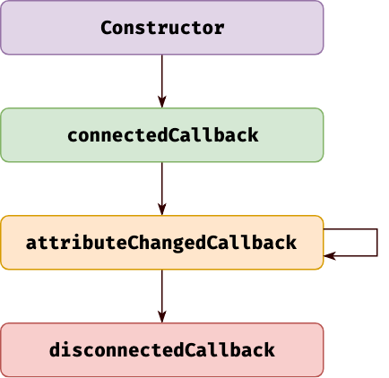
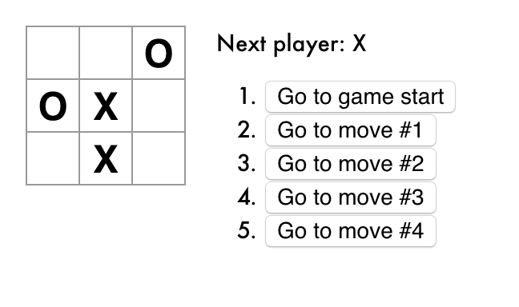
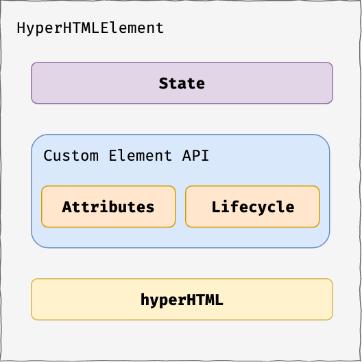
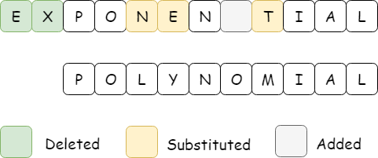

footer: Get hyper-excited for web standards - Codemotion Rome 2019
slidenumbers: true
slidecount: true


---

1. Web Components
2. Custom Elements
3. hyperHTML & HyperHTMLElement

^ I'm going to often compare with React and Angular
Not trying to convince you to abbandon React

---

# Foreword

### Not trying to convince you to abandon React/Angular/Vue 🙃

---

# Web Components

---

```html
<video controls src="video.mp4"></video>

<select>
  <option>Option 1</option>
  <option>Option 2</option>
  <option>Option 3</option>
</select>

<input type="date">
<input type="range">
```

---

```html
<div class="dropdown">
  <button class="btn btn-secondary dropdown-toggle">
    Dropdown button
  </button>
  <div class="dropdown-menu">
    <a class="dropdown-item" href="#">Action</a>
    <a class="dropdown-item" href="#">Another action</a>
    <a class="dropdown-item" href="#">Something else here</a>
  </div>
</div>
```

---


---

```html
<tabs>
  <pane title="Hello">Hello</pane>
  <pane title="World">World</pane>
</tabs>
```

---

# What if want

- Truly reusable components
- Interoperability

---

# Web Components

A suit of web standards to define reusable custom elements

1. Custom Elements
2. Shadow DOM

^ You see, no mentioning about state management, routing, network requests...

---

# Custom Elements

Create new HTML tags

```html
<c-clock></c-clock>
```

[Codepen](https://codepen.io/jiayihu/pen/vQVWNZ?editors=1010)

---

```js
const template = document.createElement('template')
template.innerHTML = `
  <div>
      <h1>Hello, world!</h1>
      <h2>It is <span class="time"></span>.</h2>
  </div>
`

class Clock extends HTMLElement {
  constructor() {
    super();
    
    this.appendChild(template.content.cloneNode(true))
    this.timeEl = this.querySelector('.time')
  }
  
  connectedCallback() {
    this.token = window.setInterval(() => {
      this.timeEl.textContent = new Date().toLocaleTimeString();
    }, 1000)
  }
  
  disconnectedCallback() {
    if (this.token) window.clearInterval(this.token);
  }
}

customElements.define('c-clock', Clock)
```

^ - use the class to create a public JavaScript API for your tag
- any properties/methods become part of the element's DOM interface

---

# Custom Element Lifecycle



---

# Tic-tac-toe XO



[in React](https://codepen.io/gaearon/pen/gWWZgR?editors=0110)

^ One thing I always loved about React is that it's just JS

---

```html
<c-square value="X"></c-square>
```

```js
const template = document.createElement('template')
template.innerHTML = `<button class="square"></button>`

class Square extends HTMLElement {
  static get observedAttributes() {
    return ['value']
  }
  
  get value() { return this.getAttribute('value') }
  set value(val) { this.setAttribute('value', val) }
  
  constructor() {
    super();
    
    this.appendChild(template.content.cloneNode(true))
    this.btnEl = this.querySelector('.square')
  }
  
  attributeChangedCallback(attr, old, curr) {
    if (attr === 'value') this.btnEl.textContent = curr;
  }
}

customElements.define('c-square', Square)
```

^
- Reflecting properties to attributes
- keep the element's DOM representation in sync with its JavaScript state

---

# Enter hyperHTML & HyperHTMLElement

```js
class Square extends HyperHTMLElement {
  static get observedAttributes() {
    return ['value']
  }
  
  render() {
    return this.html`
      <button class="square">
        ${this.value}
      </button>
    `
  }
}

Square.define('c-square')
```

---

# HyperHTML Element



---

# hyperHTML (4kB)

```js
const render = hyperHTML.bind(document.body);

function tick() {
  render`
    <div>
      <h1>Hello, world!</h1>
      <h2>It is ${new Date().toLocaleTimeString()}.</h2>
    </div>
  `;
}

setInterval(tick, 1000);
```

[Codepen](https://codepen.io/jiayihu/pen/EOdLMp)

---

# Tagged template literal

```js
function html(chunks, ...interpolations) {
  console.log(chunks);          // ['1 ', ' 3']
  console.log(interpolations);  // [2] or [4]
}
 
html`1 ${2} 3`;
html`1 ${4} 3`;
```

^ Very efficient
Low memory usage

---

# Efficient DOM

```js
const bodyRender = hyperHTML.bind(document.body);
const names = [
  { name: 'First item' },
  { name: 'Second item' },
  { name: 'Third item' }
]
 
hyperHTML.bind(document.body)`
  <h1>${document.title}</h1>
  <ul>
    ${names.map(item => `<li>${item.name}</li>`)}
  </ul>
`;
```

---

# Levenshtein algorithm



[domdiff](https://github.com/WebReflection/domdiff) based on [petit-dom](https://github.com/yelouafi/petit-dom)

---

# [Not primitive types](https://codepen.io/jiayihu/pen/QVqNGJ?editors=0010)

```js
customElements.define('h-welcome', class HyperWelcome extends HTMLElement {
    constructor() {
      super();
      this.html = hyperHTML.bind(this);
    }

    get user() { return this._user; }
    set user(value) { this._user = value; this.render(); }

    render() { return this.html`<h1>Hello, ${this._user.name}</h1>`; }
  }
);

hyperHTML.bind(document.getElementById('root'))`
  <h-welcome user=${{ name: 'Sara' }} />
  <h-welcome user=${{ name: 'Cahal' }} />
`;
```

---

# HyperHTMLElement

---

```js
class Game extends HyperHTMLElement {
  get defaultState() {
    return { history: [], stepNumber: 0 };
  }
  
  handleClick(event) { this.setState({ ... }); }
  
  render() {
    const current = this.state.history[this.state.stepNumber];

    return this.html`
      <div class="game-board">
        <c-board
          squares=${current.squares}
          onsquareclick=${e => this.handleClick(e.detail)}
        />
      </div>
    `;
  }
}
```

---

# Server side rendering with [viperHTML](https://viperhtml.js.org/viper.html)


---

# hyperHTML vs lit-html vs omi

[vs lit-html 1.0](https://medium.com/@WebReflection/lit-html-vs-hyperhtml-vs-lighterhtml-c084abfe1285)

[Tencent/omi](https://github.com/Tencent/omi)

^ easier to start with, through zero specialized syntax

---

# Custom Elements in React


- [custom-elements-everywhere](https://custom-elements-everywhere.com/)
- [Web Components in React](https://reactjs.org/docs/web-components.html)

---

# Use cases for Custom Elements and hyperHTML

- **cross-framework** UI components and libraries
  - [Primer - Github](https://primer.style/)
  - [Vaadin](https://vaadin.com/components/)
- Long-lasting web projects
- Lightweight **framework-less** **compiler-less** development

---

> Standards are the best way, if not the only one, to move the Web forward.

> - Andrea Giammarchi

---

# Last notes - [Redux](https://github.com/WebReflection/hyperHTML-Element/issues/12)

```ts
export class Homepage extends ConnectedHyperElement {
  connectedCallback() {
    super.connectedCallback();

    getFeeds().then(feeds => this.dispatch(addFeeds(feeds)));
    this.render();
  }

  stateChanged(state) {
    this.feeds = state.feeds;
    this.render();
  }

  render() {
    console.log(this.feeds)
  }
}
```

^ Redux for example is implemented in pure JS, framework agnostic and it has spread globally in Angular, React and VueJS

---

# Last notes - [Hooks](https://medium.com/@WebReflection/neverland-the-hyperhtmls-hook-a0c3e11324bb)

```ts
import stardust, {html, useState} from 'neverland';

const Counter = stardust(() => {
  const [count, setCount] = useState(0);

  return html`
    <p>You clicked ${count} times</p>
    <button onclick=${() => setCount(count + 1)}>
      Click me
    </button>
  `;
});
```

---

# Last notes - [Testing](https://github.com/WebReflection/basicHTML)

```ts
import { Button } from './Button';

describe('<mr-button>', () => {
  it('renders correct className', () => {
    const element = new Button();
    element.setAttribute('kind', 'primary');
    element.render();
    const button = element.querySelector('button');

    expect(button.classList.contains('button--primary')).toBe(true);
  });
});
```

---

# One last slide...

---

# Jiayi Hu

## [dʒʌɪ]

Front-end developer

- Twitter: [@jiayi_ghu](https://twitter.com/jiayi_ghu)
- GitHub: [github.com/jiayihu/talks](https://github.com/jiayihu/talks)
- italiajs.slack.com

---

# Get hyper-excited
