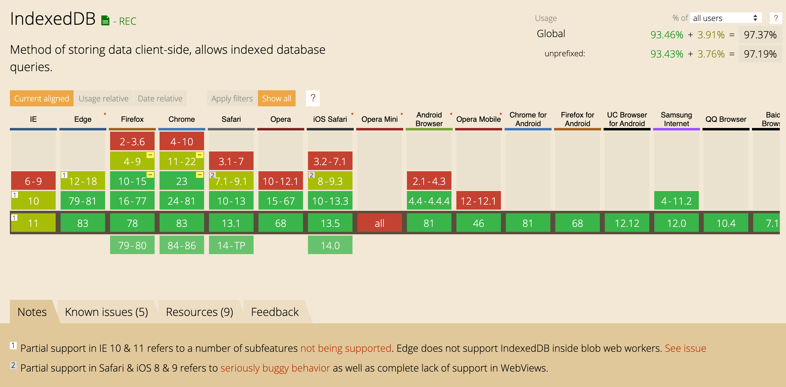
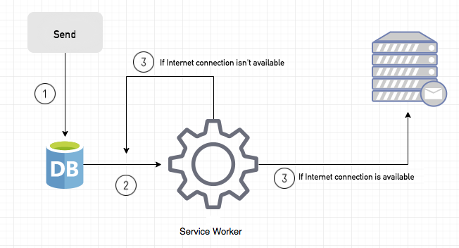
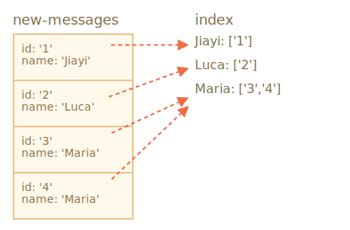

footer: aspitalia.com
slidenumbers: true

# An introduction to the strange APIs of IndexedDB

## Jiayi Hu


---

# IndexedDB

- In-browser NoSQL database
- Built-in async API
  - Results are dispatched as DOM events
- A *key-value* object-oriented database
- Transactional (ACI~~D~~)

---



---

# Support

```js
window.indexedDB = window.indexedDB 
  || window.mozIndexedDB
  || window.webkitIndexedDB
  || window.msIndexedDB;
```

Or

```js
if (!window.indexedDB) {
    console.log("IndexedDB not fully supported");
}
```

---


---

# Async API as DOM Events

```js
document.body.addEventListener('click', (event) => {
  console.log(event.target);
})
```

---

# EventTarget


---

# EventTarget


---

# IDBRequest

```ts
interface IDBRequest<T = any> extends EventTarget {
    onerror: (ev: Event) => any) | null;
    onsuccess: (ev: Event) => any) | null;

    readyState: "done" | "pending";
    result: T;
    source: IDBObjectStore | IDBIndex | IDBCursor | null;
    transaction: IDBTransaction | null;
    
    addEventListener(type: string, listener: Listener): void;
    removeEventListener(type: string, listener: Listener): void;
}
```

---

# Async API as DOM Events

```js
const request = indexedDB.open('skypeweb', 1);

request.addEventListener('error', event => {
  const error = event.target.error;
  console.error(error)
});

request.addEventListener('success', (event) => {
  const db = event.target.result;

  console.log(db);
});
```

---

# IndexedDB versioning - New version

```js
request.addEventListener('upgradeneeded', () => {
  const db = request.result;
  if (!db.objectStoreNames.contains('new-messages')) {
    db.createObjectStore('new-messages', { keyPath: 'body.messageId' });
    db.createObjectStore('old-messages', { autoIncrement: true });
  }
});

request.addEventListener('blocked', () => {
  reject('Request to open IDB was blocked');
});
```

---

# IndexedDB versioning - Old version

```js
request.addEventListener('success', () => {
  const db = request.result;

  db.addEventListener('versionchange', () => {
    db.close();
    window.location.reload();
  });
});
```

---

```js
const request = indexedDB.open("store", 2);

request.onupgradeneeded = function() {
  // Existing db version
  const db = request.result;

  switch(db.version) {
    case 0:
      ...
    case 1:
      ...
  }
};
```

---

[.code-highlight: 1-2, 7, 13]

```js
export const getIDB = (name, version) => {
  return new Promise((resolve, reject) => {
    const request = indexedDB.open(name, version);

    request.addEventListener('error', event => {
      const error = event.target.error;
      reject(error);
    });

    request.addEventListener('success', () => {
      const db = request.result;

      resolve(db);
    });

    request.addEventListener('upgradeneeded', () => {
      const db = request.result;
      if (!db.objectStoreNames.contains('new-messages')) {
        db.createObjectStore('new-messages', { keyPath: 'body.authorId' });
      }
    });
  });
};
```

---

```js
getIDB('skypeweb', 1)
  .then(db => {
    console.log(db)
  })
  .catch(error => console.error(error))
```

---

# BackgroundSync example [^1]



[^1]: https://davidwalsh.name/background-sync

---

# BackgroundSync example

```js
// service-worker.js
self.addEventListener('sync', event => {
  switch (event.tag) {
    case 'new-message': {
      console.log('New message to send')
      break;
    }
    default:
      break;
  }
});
```

---

# Transactions

> *A transaction is a unit of work that you want to treat as "a whole." It has to either happen in full or not at all.*

- **Atomic**: it must either complete in its entirety
- **Consistent**: it conforms to integrity constraints
- **Isolated**: it supports concurrency
- **~~Durable~~**: written to persistent storage

---

# Retrieve messages

```js
const operation = getIDB('skypeweb', 1)
  .then(db => {
    const transaction = db.transaction('new-messages')
    const messagesStore = transaction.objectStore('new-messages')
    const request = messagesStore.getAll();

    request.addEventListener('success', () => {
      console.log(request.result);
    })
  })
```

---

[.code-highlight: 3-6]

# Retrieve messages

```js
const operation = getIDB('skypeweb', 1)
  .then(db => {
    const request = db
      .transaction('new-messages')
      .objectStore('new-messages')
      .getAll();

    request.addEventListener('success', () => {
      console.log(request.result);
    })
  })
```

---

[.code-highlight: 8-10]

# Retrieve messages

```js
const operation = getIDB('skypeweb', 1)
  .then(db => {
    const request = db
      .transaction('new-messages')
      .objectStore('new-messages')
      .getAll();

    request.addEventListener('success', () => {
      console.log(request.result);
    })
  })
```

---

```js
function promisifyRequest(request) {
  return new Promise((resolve, reject) => {
    request.onsuccess = function() {
      resolve(request.result);
    };

    request.onerror = function() {
      reject(request.error);
    };
  });
}
```

---

[.background-color: #392A23]
[.header: #FFFFFF]

# Event bubbling


---

```js
const operation = getIDB('skypeweb', 1)
  .then(db => {
    const request = db
      .transaction('new-messages')
      .objectStore('new-messages')
      .getAll();

    return promisifyRequest(request)
      .then(messages => console.log(messages))
  })
```

---

# Save message to be sent

```js
export function addMessage(threadId, body) {
  return fetch(`threads/${threadId}/messages`, {
    method: 'POST',
    body: JSON.stringify(body),
  }).catch(() => {
    if (window.indexedDB && window.SyncManager) {
      getDb('skypeweb', 1)
        .then((db) => {
          const request = db
            .transaction('new-messages', 'readwrite')
            .objectStore('new-messages')
            .put({ body, threadId });

          return promisifyRequest(request);
        })
        .then(() => {
          return navigator.serviceWorker.ready.then((registration) => {
            return registration.sync.register('new-message');
          });
        });
    }
  });
}
```

---

```js
self.addEventListener('sync', event => {
  switch (event.tag) {
    case 'new-message': {
      const operation = getIDB('skypeweb', 1)
        .then(db => {
          const request = db
            .transaction('new-messages')
            .objectStore('new-messages')
            .getAll();

          return promisifyRequest(request)
            .then(messages => console.log(messages))
        })
      break;
    }
    default:
      break;
  }
});
```

---

```js
const operation = getIDB('skypeweb', 1)
  .then(db => {
    const request = db
      .transaction('new-messages')
      .objectStore('new-messages')
      .getAll();

    return promisifyRequest(request).then(messages => {
      const fetches = messages.map(message => {
        const { threadId, body } = message;

        return fetch('...', { body: JSON.stringify(body) })
      });

      return Promise.all(fetches);
    });
  })

event.waitUntil(operation);
```

---

```js
const { threadId, body } = message;

return fetch('...', { body: JSON.stringify(body) })
  .then(() => {
    const request = db
      .transaction('new-messages', 'readwrite')
      .objectStore('new-messages')
      .delete(body.messageId);

    return promisifyRequest(request);
  });
```

---

Transactions should be short-lived, for performance reasons.

```js
const newMessages = db
  .transaction('new-messages', 'readwrite')
  .objectStore('new-messages')
const request = newMessages
  .add({ body, bulletinId });

request.onsuccess = function() {
  fetch('/messages/').then(response => {
    const request2 = newMessages.getAll(); // <=

    request2.onerror = function() {
      console.log(request2.error.name); // TransactionInactiveError
    };
  });
};
```

---

# Event Loop


---

# Indexes



---

[.code-highlight: 6]

# Indexes

```js
request.addEventListener('upgradeneeded', () => {
  const db = request.result;
  if (!db.objectStoreNames.contains('new-messages')) {
    const messagesStore = db.createObjectStore('new-messages');

    messagesStore.createIndex('name', 'name', { unique: false });
  }
});
```

```js
const request = db
  .transaction('new-messages')
  .objectStore('new-messages')
  .index('name')
  .get('Jiayi'); // or getAll()
```

---

# Simpler abstractions

- [jakearchibald/idb-keyval](https://github.com/jakearchibald/idb-keyval)
- [jakearchibald/idb](https://github.com/jakearchibald/idb)

```js
if (!idb) 
  self.importScripts(
    'https://unpkg.com/idb@5.0.2/build/iife/index-min.js'
  );
```

---

# Storage limits

```js
navigator.storage.estimate().then(({usage, quota}) => {
  console.log(`Using ${usage} out of ${quota} bytes.`);
});
```

---

# Thanks

---

# Jiayi Hu

- Front-end developer
- [https://github.com/jiayihu](github.com/jiayihu)
- [@jiayi_ghu](https://twitter.com/jiayi_ghu)

---

# Q & A?
