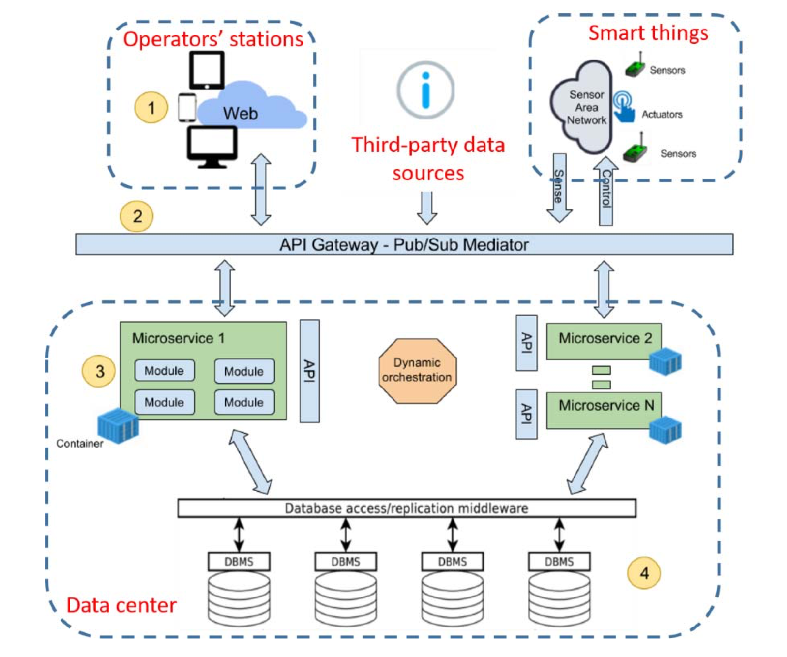

footer: Microservices patterns
slidenumbers: true
slidecount: true

[.footer: Laurea Magistrale in Informatica 2018/2019 - Università di Padova]

# Microservices patterns

## Giovanni Jiayi Hu

---

# Scaling [^1]

[^1]: [Martin Fowler - Microservices](https://martinfowler.com/articles/microservices.html)

---

---

# Microservices

> A microservice architecture is a **service-oriented architecture** composed of **loosely coupled** elements that have **bounded contexts**.

^ SOA + DDD + CI/CD

---

# Microservice

> A microservice is understood as a small **self-contained** application that has a **single responsibility**, a lightweight stack, and can be deployed, scaled and tested **independently**.

---

---

# Self-containing: Docker

---

# Forces

- Encapsulation of technology stack
- Service isolation
- Resource constraining
- Location indipendence

^ k8s orchestrates using resourse usage
Machines are not pets

---

# Solution: Docker

- **Image**: an executable package that includes everything needed to run an application
- **Isolated containers**: runtime instance of image

^ Usally image is root Linux filesystem

---

# Containerization

> The mechanism by which a **host operating system** runs programs in **isolated user-space environments**.

---

---

# Container vs Virtual Machines

- Shared host kernel and OS resources
- Less isolation but more lightweight
- Snapshot images
- Weights MB

^ - Decoupled from the underlying infrastructure and from the host filesystem
- portable across clouds and OS distributions.

---

# Orchestrating - Kubernetes 

---

# Kubernetes (K8s)

**Declarative** configuration and **automation** for for managing containerized services

^ Describe your cluster’s desired state
- what container images they use
- the number of replicas
- what network and disk resources
- service discovery

---

^ operates at the container level
^ not mere orchestration system

---

---

# Auto-scaling

- *desiredReplicas = currentReplicas * (currentMetricValue / desiredMetricValue )*
- Avoids over/under-provisioning
- Avoids *thrashing*

^ CPU utilization
Period 15s in control loop (Control Manager)

---

# Health checks

- **Liveness**: dead or alive (no zombies)
- **Readiness**: ready to serve traffic
- Probes: HTTP request / TCP connection / exec

---

# Rolling Updates

- Zero down-time
- Guarantee minimum availability
- Use health checks
- Ability to roll back to a past version (**rollout**)

---

# Forces

- Encapsulation of microservices
- Single entry point
- Stable HTTP endpoint to reach services
- Route Level 7 traffic

^ K8s services allow only communication inside the cluster
Services use TCP/AMQP

---

# API Gateway

---

# API Gateway - Ambassador

- Level 7 load balancing
- HTTP routing
- Authentication
- Rate limiting

---

# Database architecture

---

# Relational databases scalability

1. Inefficient joins across nodes
2. Distributed transactional processing: X/Open XA
3. Reduced availability

^ XA: Blocking protocol, reduced availability

---

# CAP Theorem

> It is impossible for a distributed data store to simultaneously provide more than two out of the following three guarantees: consistency, availability, partition tolerance.
> - Eric Brewer

---

# Forces

- Services must be **loosely coupled**
- **Enforce invariants** that span multiple services
- Need to **query/join** data that is owned by multiple services
- Must be **replicated and sharded**
- Data storage have **different requirements**

---

---

# Database per service - Advantages

1. Loose coupling
2. Different data storages
3. Deployed, scaled and tested independently
4. Resiliency

---

# Database per service - Drawbacks 😭

1. Transactions across services
  - **Saga pattern** at application level
2. Joining data is challenging
  - **API composition** at application level
  - **CQRS pattern** at application level
3. Complexity

---

> The hardest part About microservices: your data [^*]

[^*]: [The Hardest Part About Microservices: Your Data](https://blog.christianposta.com/microservices/the-hardest-part-about-microservices-data/)

---

# Application level patterns

---

# Forces

1. Retrieve data scattered across multiple services
2. Enforcing business invariants
3. Handle inefficient/unsupported query in service storage database

---

# Solutions

- API Composition / Gateway
- **Command Query Responsibility Segregation (CQRS)**

^ API composition inefficient
Reduced availability
Network usage
Avoid centralizing logic

---

^ Loose coupling
Efficient queries
Replication lag

---

---

# Interprocess communication

---

# Sync vs async

- Sync is blocking: a service waits for the response
- Sync reduces availability
- But sync REST API are required

^ REST is a request/reply protocol

---

# Forces

- Async and time decoupled communication
- Availability
- Loose coupling
- Message buffering

---

# RPC vs Message Queuing

- RPC is *usually* sync
- RPC increases coupling and reduces availability
- MQ can be persisted and guarantees delivery
- MQ is **loosely coupled in time**

^ RPC: know procedure name and interface

---

**The biggest issue** in changing a monolith into microservices lies in changing the communication pattern.

A naive conversion from in-memory method calls to RPC leads to chatty communications which don't perform well. 

> - Martin Fowler

---

# Broker-based MQ - Advantages

- Loose coupling
- No discovery mechanism
- Message buffering
- Explicit interprocess communication
- Can convert messages to be understood by the destination

---

# Broker-based MQ - Disadvantages

- Potential performance bottleneck
- Potential single point of failure

---

# Message broker charateristics

- Message ordering
- Delivery guarantees
- Persistence
- Durability
- Latency

---

# Not a panacea

- Message duplication
  - **Idempotent** message handlers
  - Track messages
- Transactional messaging

---

# RabbitMQ

- AMQP implementation
- Connection, channel
- Producer, consumer, queue
- Durability

---

---

---

---

# Distributed transaction management

---

# Orchestrator Saga

^ Correlation id

---

# Saga

- A message-driven sequence of local transactions
- Reacts to command events and generates new commands
- **ACD** (no Isolation)
- Must use countermeasures

---

# Compensating transactions

---

# Anomalies

> An anomaly is when a transaction reads or writes data in a way that it wouldn’t if transactions were executed one at time.

1. Lost updates
2. Dirty reads

---

# Counter-measures [^2]

- Semantic lock
- Commutative updates
- Pessimistic view
- Reread value

[^2]: [Semantic ACID properties in multidatabases using remote procedure calls and update propagations](https://dl.acm.org/citation.cfm?id=284472.284478)

^ Lock: deadlocks

---

---

---

# Forces

- A paradigm to manage **sequences of async events**
- Push based programming
- Responsive
- Non-blocking

^ Can handle change, instead of discrete

---

# Reactive systems [^3]

- Systems which continuously respond to
inputs
- Reactive systems interact with the environment at a pace dictated by the environment

^ vs transformational systems

[^3]: [Reactive programming and its effect on performance and the development process](http://lup.lub.lu.se/luur/download?func=downloadFile&recordOId=8932146&fileOId=8932147)

---

# Reactive programming [^4]

[^4]: [Functional Reactive Animation 1997](http://conal.net/papers/icfp97/)

---

> Reactive programming is a declarative programming paradigm concerned with data streams and the propagation of change.

---

---

---

---

---

[.background-color: #FFFFFF]

---

> Autonomy

---

> The future is already here — it’s just not very evenly distributed.

> — William Gibson
