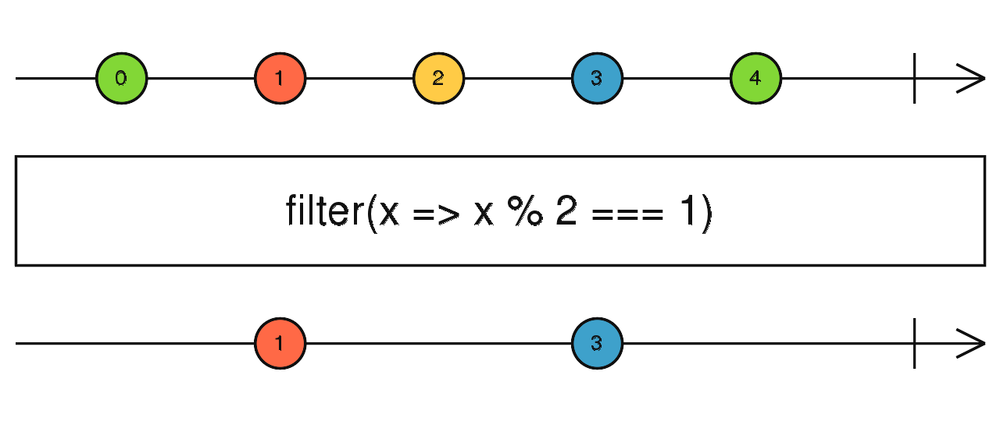

footer: A complete tour of microservices
slidenumbers: true
slidecount: true

[.footer: Laurea Magistrale in Informatica 2018/2019 - Università di Padova]

# A complete tour of microservices

## Giovanni Jiayi Hu

---

# Scaling

1. **Size** scalability
2. **Geographical** scalability
3. **Administrative** scalability

---

---

# Microservices

> A microservice architecture as a **service-oriented architecture** composed of **loosely coupled** elements that have **bounded contexts**.

^ SOA + DDD + CI/CD

---

# Microservice

> A microservice is understood as a small **self-contained** application that has a **single responsibility**, a lightweight stack, and can be deployed, scaled and tested **independently**.

---

---

# Self-containing: Docker

---

# Docker

- **Image**: an executable package that includes everything needed to run an application
- **Isolated containers**: runtime instance of image

---

# Docker container

- Isolated group of processes that are restricted to a private root filesystem and process namespace
- Isolate filesystem and network
- Can’t see each others’ processes
- Resource usage can be bounded

---

# Container vs Virtual Machines

- Shared host kernel and OS resources
- Less isolation but more lightweight
- Snapshot images
- Based on OS-level virtualization
- Weights MB

^ - Decoupled from the underlying infrastructure and from the host filesystem
- portable across clouds and OS distributions.

---

---

# Service

> Just a “container in production.” 

^ - The way to run one image
- what ports it should use

---

# Orchestrating - Kubernetes 

---

# Kubernetes (K8s)

Declarative configuration and automation for for managing containerized services

^ Describe your cluster’s desired state
- what container images they use
- the number of replicas
- what network and disk resources
- service discovery

---

^ operates at the container level
^ not mere orchestration system

---

---

---

# K8s entities

- Pods
- Controllers
- Deployments

---

# Service

> A Kubernetes Service is an abstraction which defines a logical set of Pods and a policy by which to access them.

---

# Auto-scaling

?

---

# Health checks

- **Liveness**: dead or alive (no zombies)
- **Readiness**: ready to serve traffic
- Probes: HTTP request / TCP connection / exec

---

# Rolling Updates

---

---

---

# API Gateway

- Application level load balancing
- HTTP routing
- Authentication
- Rate limiting

---

# Database architecture

---

# Relational databases scalability

1. Inefficient joins across nodes
2. Distributed transactional processing: XA
3. Reduced availability

^ XA: Blocking protocol, reduced availability

---

# Database architecture - Requirements

- Services must be **loosely coupled**
- **Enforce invariants** that span multiple services
- Need to **query/join** data that is owned by multiple services
- Must be **replicated and sharded**
- Data storage have **different requirements**

---

# Database per service - Advantages

1. Loose coupling
2. Different data storages

---

# Database per service - Drawbacks

1. Transactions across services
  - **Saga pattern** at application level
2. Joining data is challenging
  - **API composition** at application level
  - **CQRS pattern** at application level
3. Complexity

---

# Replication

---

# Replication

---

# Sharding

^ - Balanced write/read, can target specific shard if query includes key
- Storage
- Availability

---

# Sharding

---

# Application level patterns

---

# Forces

1. Retrieve data scattered across multiple services
2. Enforcing business invariants
3. Inefficient/unsupported query in service storage database

---

# Solutions

- API Composition / Gateway
- **CQRS**

---

^ Loose coupling
Efficient queries
Replication lag

---

---

# Interprocess communication

---

# Sync vs async

- Sync is blocking: a service waits for the response
- Sync reduces availability
- Sometimes sync REST API are required

^ REST is a request/reply protocol

---

# Message queuing

- Delivery guarantees
- Communication **loosely coupled in time**

---

# RPC vs Message Queuing

- RPC is *usually* sync
- RPC increases coupling and reduces availability
- MQ can be persisted

---

# Broker-based MQ - Advantages

- Loose coupling
- No discovery mechanism
- Message buffering
- Explicit interprocess communication
- Can convert messages to be understood by the destination

---

# Broker-based MQ - Disadvantages

- Potential performance bottleneck
- Potential single point of failure

---

# RabbitMQ

- AMQP implementation
- Connection, channel
- Producer, consumer, queue
- Durability

---

---

---

---

# Saga

---

# Saga

- A message-driven sequence of local transactions
- Reacts to command events and generates new commands
- **ACD** (no Isolation)
- Must use countermeasures

---

# Reactive programming

---

---

---

---

# Final notes

- How to organize code: **monorepo**
- Is DRY dead with microservices?
- Conway's law: how to organize the company

---

# Not covered

- Service mesh: Istio / Envoy Proxy
- Authentication

^ Network is not secure

---

# Microservices - Advantages

- **Continuous delivery** and deployment of large, complex applications
- Small and easily maintained by autonomous teams
- Independently **deployable and scalable**
- Better **fault isolation**
- Adoption of different technologies

---

# Microservices - Disadvantages

- Complexity of creating a distributed system
- Careful coordination between services
- Interprocess communication mechanism
- Each service has its own database: challenging transactions and queries

---

> The future is already here — it’s just not very evenly distributed.

> — William Gibson

---

# References

- [jiayihu/microservices](https://github.com/jiayihu/lab/tree/master/microservices)
- [Distributed Systems, 3rd edition - Maarten van Steen, Andrew S. Tanenbaum](https://www.distributed-systems.net/)
- [Domain-Driven Design - Eric Evans](https://www.amazon.it/Domain-Driven-Design-Tackling-Complexity-Software/dp/0321125215)
- [Experimenting with microservices - Alberto Simioni, Tullio Vardanega](https://ieeexplore.ieee.org/document/8456408/)
- [X/Open XA](https://en.wikipedia.org/wiki/X/Open_XA)

---

# References

- [Docker docs](https://docs.docker.com/)
- [Kubernetes Concepts](https://kubernetes.io/docs/concepts/)
- [Microservice Architecture - Database per service](https://microservices.io/patterns/data/database-per-service.html)
- [MongoDB Replication](https://docs.mongodb.com/manual/replication/)
- [MongoDB Sharding](https://docs.mongodb.com/manual/sharding/)
