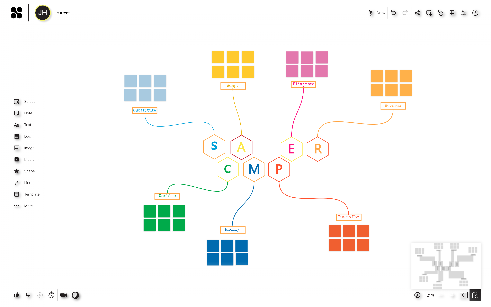
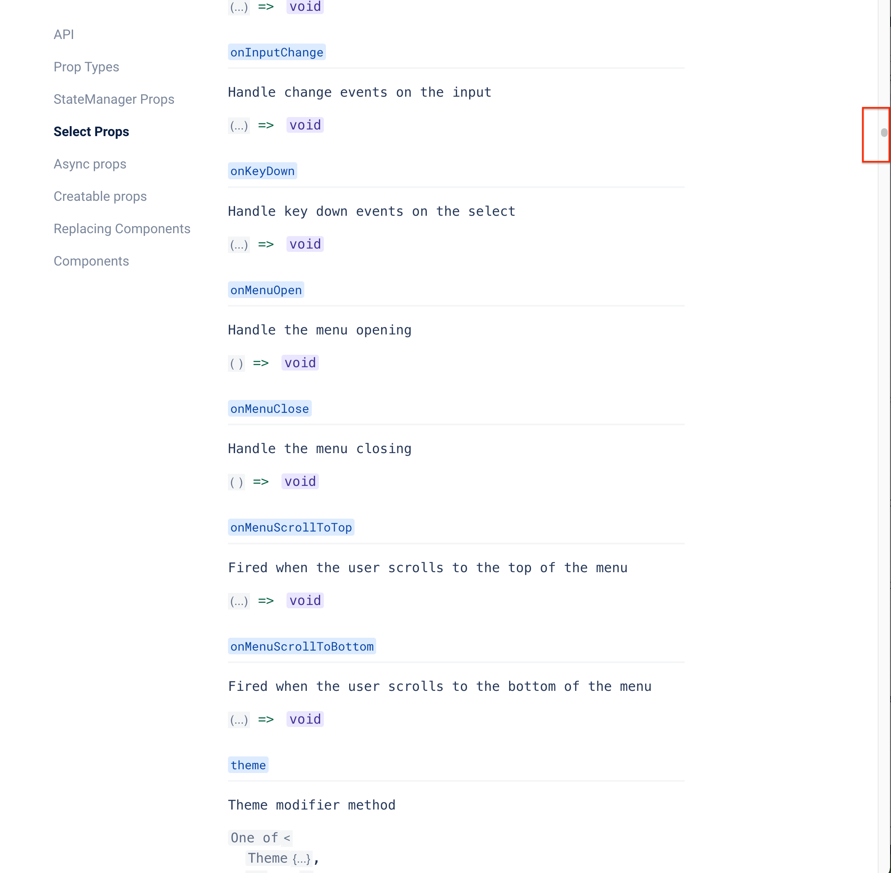
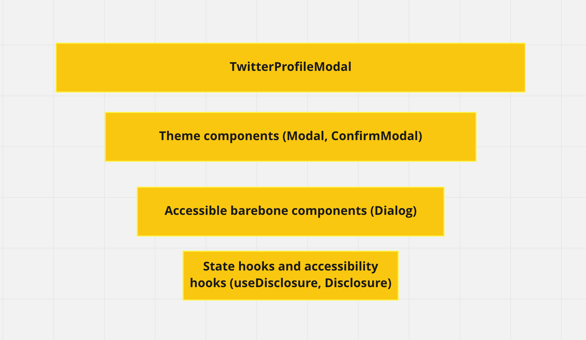
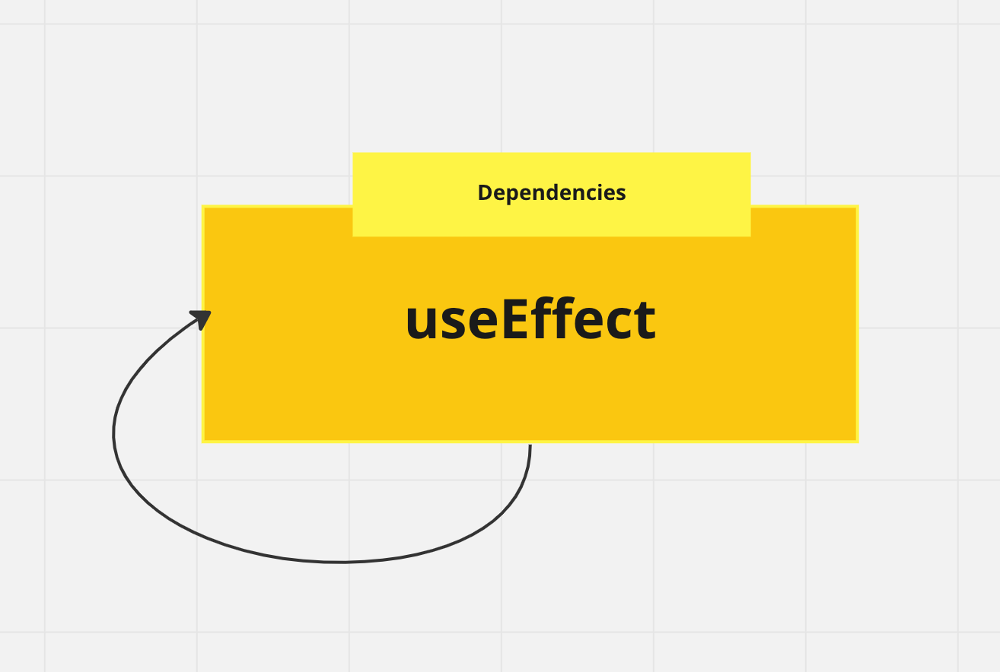
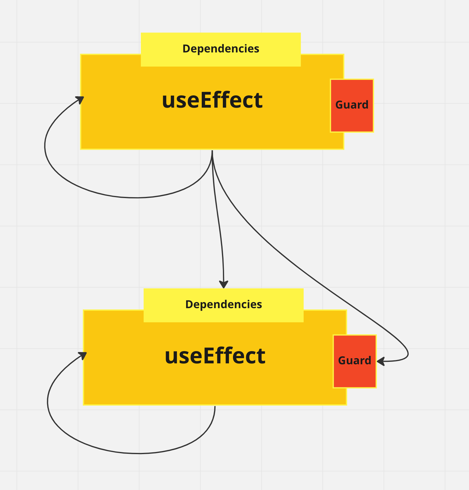
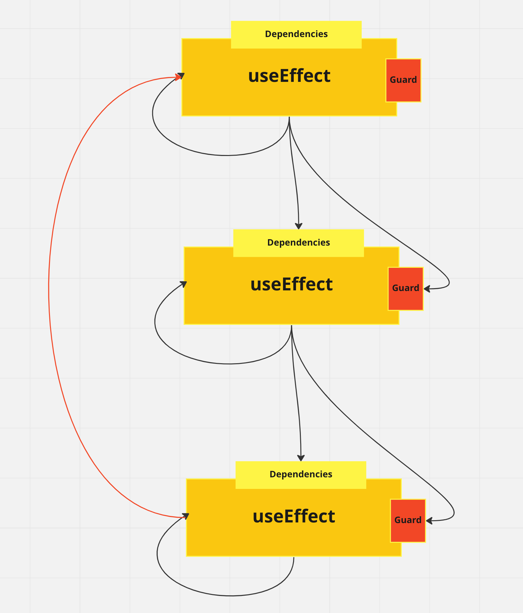
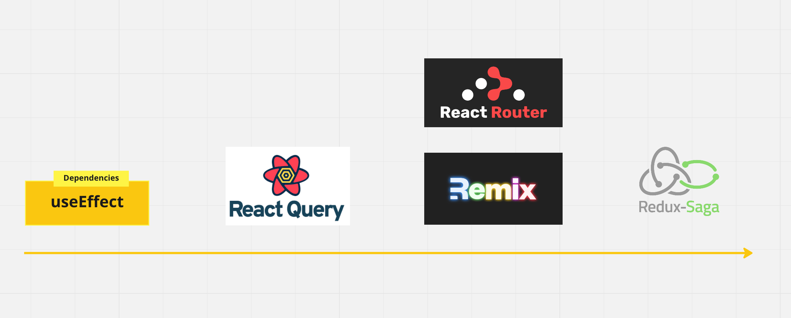
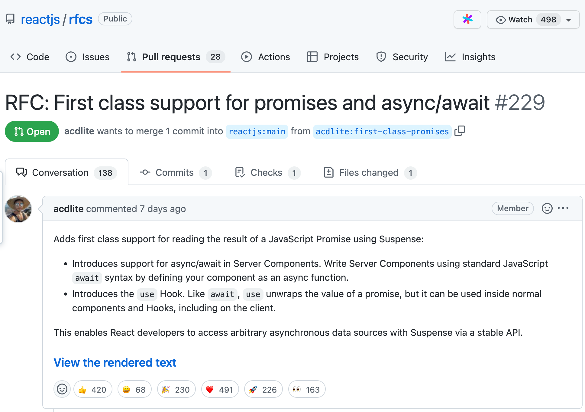

slidenumbers: true
autoscale: true

# Principles and patterns in designing good React components

---


---



---


---


---

# Complexity

"Complexity is anything related to the structure of a software system that makes it **hard to understand and modify** the system."

---

# Causes of complexity

- Obscurity
- Lack of good composition

---

# Obscurity

"Obscurity occurs when important information is not obvious."

---

Sometimes an implementation that requires more lines of code is actually simpler, because it reduces cognitive overload

---

> Code is written once, read 100x more times.

---

# Components with too many props

[.column]



[.column]

[https://react-select.com/props](https://react-select.com/props)

```js
import Select from 'react-select'

const options = [
  { value: 'chocolate', label: 'Chocolate' },
  { value: 'strawberry', label: 'Strawberry' },
  { value: 'vanilla', label: 'Vanilla' }
]

const MyComponent = () => (
  <Select options={options} />
)
```

---

# Reduce obscurity

Avoid optional parameters or props, prefer consistent explicit props

```js
export type DialogState = {
  visible?: boolean;
  animated?: boolean | number;
};

// Used as hook
useDialog()

// Used as component
<Dialog></Dialog>
```
---

[.column]

```js
export type DialogState = {
  visible: boolean;
  animated: boolean | number;
};

// Used as hook
useDialog({ visible: true, animated: false })

// Used as component
<Dialog visible animated></Dialog>
```

[.column]

- Make props or parameters more **discoverable**
- Make reading the code easier, with **less cognitive overload**
- Simplify implementation
  Less `props?.visible ?? false`

---


---

# Reduce obscurity

Use **dimiscriminated union types** in TypeScript for less optional props and more explicit-consistent props

---

```typescript
export type ShippingAddress = {
  name: string;
  street: string;
  city: string;
  postalCode: string;

  isPickup: boolean;
  pickupCompany?: string;
};

export type PaymentMethod = {
  paymentMethod: string;
  cardNumber: string;
  cardExpiration: string;
  cardCode: string;
};
```

---

[.code-highlight: 7-8, 12]

```typescript
export type ShippingAddress = {
  name: string;
  street: string;
  city: string;
  postalCode: string;

  isPickup: boolean;
  pickupCompany?: string;
};

export type PaymentMethod = {
  paymentMethod: string;
  cardNumber: string;
  cardExpiration: string;
  cardCode: string;
};
```

---

# Discriminated union types - Avoid invalid states

```js
type CommonInfo = {
  name: string;
  street: string;
  city: string;
  cap: string;
};

type SendToHome = CommonInfo & { kind: 'SendToHome' };

type SendToPickupPoint = CommonInfo & { kind: 'SendToPickupPoint'; company: string };

type ShippingAddress = SendToHome | SendToPickupPoint;
```

- `kind` is called discriminant property

---

# Type narrowing again

```ts
function handleShipping(address: ShippingAddress) {
  // typeof address.kind === 'SendToHome' | 'SendToPickupPoint'
  console.log(address.company); // TS Error

  if (address.kind === 'SendToHome') {
    // typeof address.kind === 'SendToHome'
    console.log(address.company); // TS Error
    return;
  }

  // typeof address.kind === 'SendToPickupPoint'

  if (address.kind === 'SendToPickupPoint') {
    console.log(address.company); // Okay and with autocomplete
    return;
  }

  // typeof address.kind === never
  assertUnreachable(address.company)
}
```

---

# Lack of composition

Composition is at the core of how we program software

---

# Composition

```html
<Modal 
  isOpen={modalIsOpen}
  headerLabel="Modal header"
  contentLabel="Content label"
>
  <button onClick={closeModal}>close</button>
  <div>I am the modal content</div>
</Modal>
```

---

Functions are more composable than string or even objects

- Prefer function props
- Render props
- Prefer component composition than complex props

---

[.code-highlight: 3-5]
```js
<Modal 
  isOpen={modalIsOpen}
  header={() => <Text>Modal header</Text>}
  contentLabel={() => <Text bold>Modal header</Text>}
>
  <button onClick={closeModal}>close</button>
  <div>I am the modal content</div>
</Modal>
```

---

```html
<Modal isOpen={modal}>
  <ModalHeader>Modal header</ModalHeader>
  <ModalBody>
    Modal content
  </ModalBody>
  <ModalFooter>
    <Button color="primary" onClick={toggle}>
      Do Something
    </Button>
    <Button color="secondary" onClick={toggle}>
      Cancel
    </Button>
  </ModalFooter>
</Modal>
```

---


---

# Ariakit

```js
import { useDialogState, Dialog, DialogDisclosure } from "reakit/Dialog";

function Example() {
  const dialog = useDialogState();
  return (
    <>
      <DialogDisclosure {...dialog}>Open dialog</DialogDisclosure>
      <Dialog {...dialog} aria-label="Welcome">
        Welcome to Verona!
      </Dialog>
    </>
  );
}
```

---

```js
function useDelayedDialogState({ delay, ...initialState }) {
  const disclosure = useDialogState(initialState);
  const [transitioning, setTransitioning] = React.useState(false);

  return {
    ...disclosure,
    transitioning,
    toggle: () => {
      setTransitioning(true);
      setTimeout(() => {
        disclosure.toggle();
        setTransitioning(false);
      }, delay);
    },
  };
}
```

---

```js
function Example() {
  const dialog = useDelayedDialogState({ delay: 200 });
  return (
    <>
      <DialogDisclosure {...dialog}>Open dialog</DialogDisclosure>
      <Dialog {...dialog} aria-label="Welcome">
        Welcome to Verona!
      </Dialog>
    </>
  );
}
```

---

```html
// "as" prop
<Disclosure as={Button}>Show</Disclosure>

// render prop
<Disclosure>
  {(props) => <Button type="button {...props}>Show</Button>}
</Disclosure>
```

---

# Software is built on-top-of software (i.e. composed)



---

# What is an Effect really?

- Variable mutations
- A DOM mutation or listening
- Canvas mutations
- Data fetching and revalidation
- WebSocket and WebRTC messages

---

```js
useEffect(() => {
  if (!options.animated) {
    return undefined;
  }

  const raf = window.requestAnimationFrame(() => {
    if (options.visible) {
      setTransition('enter');
    } else if (animating) {
      setTransition('leave');
    } else {
      setTransition(null);
    }
  });

  return () => window.cancelAnimationFrame(raf);

}, [options.animated, options.visible, animating]);
```

---

# API Effects

```ts
function getUserProfile(userId: string): Promise<UserProfile>

const [profile, setProfile] = useState<UserProfile | null>(null)

useEffect(() => {
  getUserProfile(userId).then(profile => setProfile(profile))
}, [userId]);
```

---

# API Effects

```js
type RequestState = 
| { isLoading: false, profile: undefined, error: null }
| { isLoading: true, profile: undefined, error: null }
| { isLoading: false, profile: UserProfile, error: null }
| { isLoading: false, profile: undefined, error: Error }

const [requestState, setRequestState] = useState<UserProfile>(
  { isLoading: false, profile: undefined, error: null }
)

useEffect(() => {
  setRequestState({ isLoading: true, profile: undefined, error: null })

  getUserProfile(userId).then(profile => setRequestState(
    { isLoading: false, profile, error: null }
  )).catch(error => setRequestState({ isLoading: false, profile: undefined, error }))
}, [userId]);
```

---

# React Query

```js
const { isLoading, data: profile, error } = useQuery(
  ["userProfile", userId],
  () => getUserProfile(userId)
)
```

---

# Real world data fetching features [^1]

- Caching
- Retries on failure
- Deduping multiple requests for the same data into a single request
- Updating "out of date" data in the background
- Knowing when data is "out of date"
- Performance optimizations like pagination and lazy loading data

[^1]: [source](https://tanstack.com/query/v4/docs/overview)

---

React Query is just useEffect for data fetching on steroids

---

# Dependent Effects

```js
const [profile, setProfile] = useState<UserProfile | null>(null)
const [userProject, setUserProject] = useState<UserProjects | null>(null)

useEffect(() => {
  getUserProfile(userId).then(profile => setProfile(profile))
}, [userId]);

useEffect(() => {
  if (userProfile) {
    getUserProject(userProfile.projectId).then(project => setUserProject(project))
  }
}, [userProfile]);
```

---


---



---



---



---

```js
const { data: userProfile } = useQuery(['userProfile', userId], () => getUserProfile(userId))

const projectId = user?.projectId

// Then get the user's projects
const { status, fetchStatus, data: projects } = useQuery(
  ['projects', userId],
  () => !!projectId && getUserProject(projectId),
  {
    // The query will not execute until the projectId exists
    enabled: !!projectId,
  }
)
```

---

# Promises compose better than useEffect

```js
async function effect() {
  const userProfile = await getUserProfile(userId);
  const userProject = await getUserProject(userProfile.projectId)
}
```

---

[.code-highlight: 2-4]

```js
const userProfile = await getUserProfile(userId);
const userProjects = await Promise.all(
  userProfile.projectIds.map(projectId => getUserProject(projectId))
)
```

---

No Promise composition for errors though!

- Effect cancellation
- Effect retries
- Effect race conditions

---

# No loops for hooks

```js
userProfile.projectIds.map(projectId => {
  return useEffect(() => {
    getUserProject(userProfile.projectId)
  }, [projectId]);
})
```

---

```js
const results = useQueries({
  queries: userProfile.projectIds.map(projectId => {
    return {
      queryKey: ['userProject', projectId],
      queryFn: () => getUserProject(projectId),
      staleTime: Infinity
    }
  })
})
```

---

What else can we use to compose Effects better?

- Observables (rxjs)
- Generators (redux-saga)

---

# Effect management is a sprectrum



---

useEffect is a **low-level building block**. In practice, it’s likely the community will start moving to higher-level Hooks.

- Dan Abramov - A Complete Guide to useEffect (2019)

---

I personally like using

- useEffect for **synchronizing DOM changes**
- useQuery and useMutation for the **lifecycle of standalone API requests**
- sagas for Effects (tipically network Effects) **orchestration**

---



---

[.code-highlight: 2, 5-7]

```js
function Note({id, shouldIncludeAuthor}) {
  const note = use(fetchNote(id));

  let byline = null;
  if (shouldIncludeAuthor) {
    const author = use(fetchNoteAuthor(note.authorId));
    byline = <h2>{author.displayName}</h2>;
  }

  return <div>...</div>
}
```

---

# Dependent effects

```js
const userProfile = use(getUserProfile(userId));
const userProject = use(getUserProject(userProfile.projectId))
```

# Loop over effects

```js
userProfile.projectIds.map(
  projectId => use(getUserProject(projectId))
)
```

---

- Complexity
- Obscurity and lack of composition
- When writing code: Design for composition
- When picking a tool: How is it gonna help me compose better?

---

# Composing 

- Components
- Effects
- Types (?)
- Errors (?)

---

# Jiayi Hu

Front-end developer & consultant

- Twitter: [@jiayi_ghu](https://twitter.com/jiayi_ghu)
- Github: [@jiayihu](https://github.com/jiayihu)
- Email: [jiayi.ghu@gmail.com](mailto:jiayi.ghu@gmail.com)
