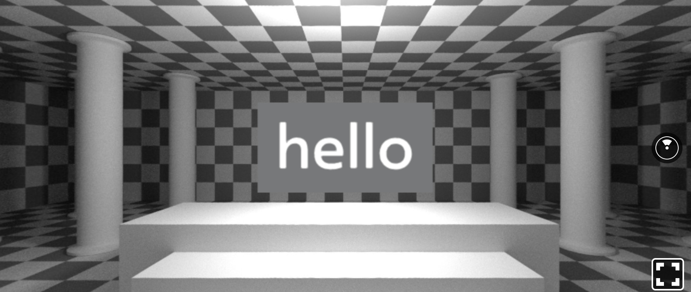
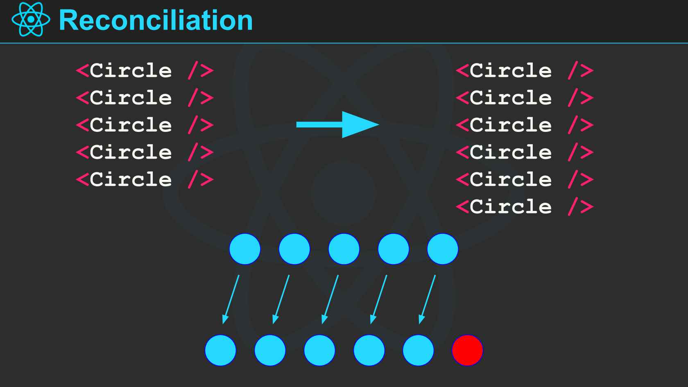
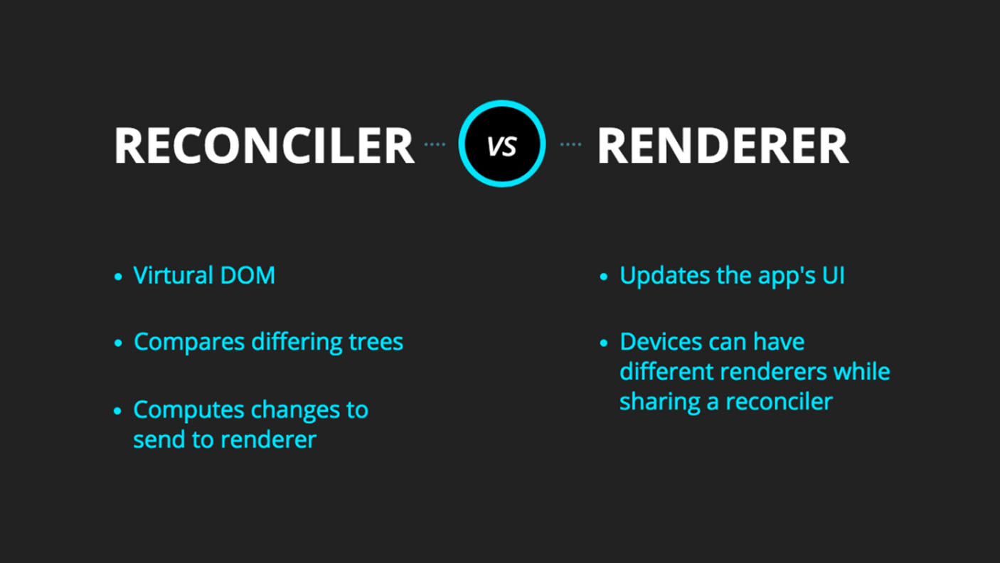
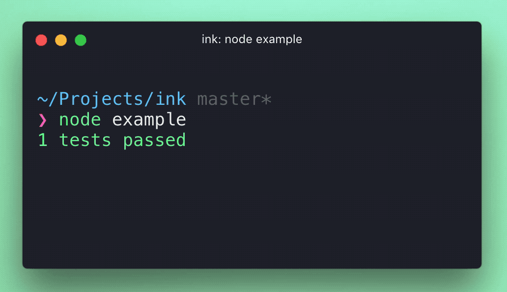

footer: Fevr - Can't live if livin' is without rendering
slidenumbers: true

# Can't live if livin'
#  is without rendering

^ Not a talk about detailed implementation, but about the ispiration that comes from.
1. Ispiration
2. Demistifying React

---

# Jiayi Hu

Front-end developer & consultant

- [https://github.com/jiayihu](https://github.com/jiayihu)
- [https://twitter.com/jiayi_ghu](@jiayi_ghu)
- [jiayi.ghu@gmail.com](jiayi.ghu@gmail.com)

---

# [fit] Some history 👴🏻

---

# _May 2013_ - React is open-sourced [^1]

```js
import React, { Component } from 'react';
import ReactDOM from 'react-dom';

var Greeting = React.createReactClass({
  render: function() {
    return <h1>Hello, {this.props.name}</h1>;
  }
});

ReactDOM.render(<Greeting name="Fevr"></Greeting>, document.querySelector('.root'));
```

[^1]: [React: Rethinking best practices](https://youtu.be/x7cQ3mrcKaY)

^ Virtual DOM allows developer to focus on logic instead of DOM rendering

---

# _March 2015_ - React Native is open-sourced

```js
import React, { Component } from 'react';
import { AppRegistry, Text } from 'react-native';

export default class HelloWorldApp extends Component {
  render() {
    return (
      <Text>Welcome to React Native</Text>
    );
  }
}

AppRegistry.registerComponent('HelloWorldApp', () => HelloWorldApp);
```

---
[.hide-footer]


---

# _Oct 2016_ - React VR is announced

```js
import React from 'react';
import { AppRegistry, asset, Pano, Text, View } from 'react-vr';

class WelcomeToVR extends React.Component {
  render() {
    return (
      <View>
        <Pano source={asset('chess-world.jpg')}/>
        <Text>hello</Text>
      </View>
    );
  }
};

AppRegistry.registerComponent('WelcomeToVR', () => WelcomeToVR);
```

---
[.hide-footer]



^ And now the most important event so far

---

# _April 2017_

React Fiber is announced [^fiber]


[^fiber]: [Lin Clark - A Cartoon Intro to Fiber](https://youtu.be/ZCuYPiUIONs)

---
[.hide-footer]



---

# _29 Nov 2017_

Fevr in AQuest

---
[.hide-footer]



---

# ReactSpeech

```html
import React from 'react';
import { ReactSpeech } from './renderer/speech-renderer';

ReactSpeech.render([
  <alice key={1}>Ciao Fevr</alice>,
  <luca key={2}>Benvenuti al mio talk di React</luca>,
]);
```

---
[.hide-footer]


---

# Terminology

1. React **Component**
2. React **Element**
3. ReactFiber **Instance**

---

# React Component

```js
class Greeting extends React.Component {
  render() {
    return <h1>Hello, {this.props.name}</h1>;
  }
}
```

---

# React Element

```js
const element = <h1>Hello, world</h1>;

// Compiled
const element = React.createElement(
  'h1',
  {},
  ['Hello world']
);
```

---

# ReactFiber Instance

```js
createInstance(type, props) {
  const instance = document.createElement('h1');
  instance.textContent = 'Hello world';

  return instance;
},
```

^ The Renderer transforms an Element into a target Instance

---

# Pre-React 16 Fiber

```js
import ReactInjection from 'react/lib/ReactInjection';

function inject() {
  ReactInjection.NativeComponent.injectGenericComponentClass(
    MyCustomComponentClass
  );
}
```

---

# Post-React 16 Fiber

```js
import Reconciler from 'react-reconciler';

const MyRenderer = Reconciler(HostConfig);
```

---

# [fit] Warning! Unstable API

> react-reconciler@0.6.0

---

[.hide-footer]


---

[.hide-footer]


---

# Create instance

```js

createInstance(type, props, internalInstanceHandle) {
  return document.createElement(type);

  // Do something with the props
}

createTextInstance(text, rootContainerInstance, internalInstanceHandle) {
  return text;
}
```

---

# Scheduling

```js
{
  now: ReactDOMFrameScheduling.now,
  useSyncScheduling: true,
  ...
}
```

---

# Mutation

```js
mutation: {
  appendChild(parentInstance, child) {},
  appendChildToContainer(parentInstance, child) {},

  removeChild(parentInstance, child) {},
  removeChildFromContainer(parentInstance, child) {},

  insertBefore(parentInstance, child, beforeChild) {},

  commitUpdate(instance, updatePayload, type, oldProps, newProps) {},
  commitMount(instance, type, newProps) {},
  commitTextUpdate(textInstance, oldText, newText) {},
},
```
---

# ReactSpeech

```js
import Reconciler from 'react-reconciler';

const SpeechRenderer = Reconciler(HostConfig);

export const ReactSpeech = {
  render(element, callback) {
    const root = SpeechRenderer.createContainer({});
    SpeechRenderer.updateContainer(element, root, null, callback);
  },
};
```

---

# Usage

```html
import React from 'react';
import { ReactSpeech } from './renderer/speech-renderer';

ReactSpeech.render([
  <alice key={1}>Ciao Fevr</alice>,
  <luca key={2}>Benvenuti al mio talk di React</luca>,
]);
```

---

# Awesome custom renderers

- [react-sketchapp](https://github.com/airbnb/react-sketchapp)

---
[.hide-footer]


---

- [react-pdf (pdfkit)](https://github.com/diegomura/react-pdf) & [react-redocx (officegen)](https://github.com/nitin42/redocx)

```js
import React from 'react';
import { Page, Text, View, Document, StyleSheet } from '@react-pdf/core';
import ReactPDF from '@react-pdf/node';

const MyDocument = () => (
  <Document>
    <Page size="A4">
      <View>
        <Text>Section #1</Text>
      </View>
    </Page>
  </Document>
);

ReactPDF.render(<MyDocument />, `${__dirname}/example.pdf`);
```

---

- [Ink](https://github.com/vadimdemedes/ink)

```js
import React from 'react';
const {h, render, Component, Text} = require('ink');

class Counter extends Component {
	constructor() {
		this.state = { i: 0 };
	}

	componentDidMount() {
		setInterval(() => {
			this.setState({ i: this.state.i + 1 });
		}, 100);
	}

  render() {
		return <Text green>{this.state.i} tests passed</Text>
	}
}

render(<Counter/>);
```

---
[.hide-footer]



---

# Awesome custom renderers

- [react-tv](https://github.com/raphamorim/react-tv)
- [react-hardware](https://github.com/iamdustan/react-hardware)

---

# [fit] For dauntless people

react-tiny-dom ⭐️: [github.com/jiayihu/react-tiny-dom](https://github.com/jiayihu/react-tiny-dom)

---

# Resources

- ReactSpeech: [github.com/jiayihu/experiments](https://github.com/jiayihu/experiments)
- Slides: [slideshare.net/GiovanniJiayiHu/fevr-cant-live-if-livin-is-without-rendering](https://www.slideshare.net/GiovanniJiayiHu/fevr-cant-live-if-livin-is-without-rendering)
- react-tiny-dom ⭐️: [github.com/jiayihu/react-tiny-dom](https://github.com/jiayihu/react-tiny-dom)

---

# ReactDOM.render(
#   <h1>Thanks!</h1>
# );
