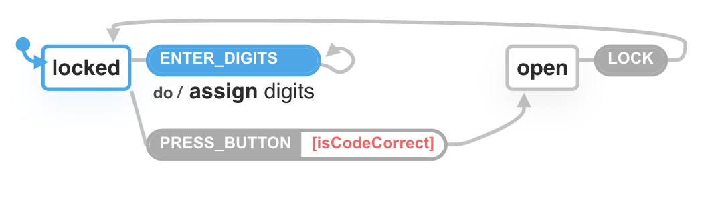

footer: State of state machines in front-end
slidenumbers: true
slidecount: true


---

# Schedule of this talk

1. Introduction to State machines
2. State machines in JavaScript
3. State machines in TypeScript
4. State machines in Redux
5. State machines in xstate

---

# Introduction to state machines


$$(\Sigma, S, s_0, \delta, F)$$

- $$\Sigma$$ the input symbols
- $$S$$ the set of states
- $$s_0$$ the initial state
- $$\delta$$ the state transition function $$\delta: S \times \Sigma \rightarrow S$$
- $$F$$ the final state, possibly empty

^ Multiple of three

---

# Regex


`a+[bc]2d`

- $$\Sigma = \{a, b, c, d\}$$ 
- $$S = \{1, 2, 3, 4, 5\}$$
- $$s_0 = 1$$ the initial state
- $$\delta$$
- $$F = 5$$

---

# Lock


$$\Sigma = \{\text{ENTER_INVALID, ENTER_CORRECT, TIMEOUT}\}$$ 

- $$S = \{locked, open\}$$
- $$s_0 = locked$$ the initial state
- $$\delta$$ = `function transition(state: S, symbol: Sigma): S`
- $$F = \emptyset$$

---

> Every Component is actually an *implicit state machine*

---

```js
class StateMachine {
  constructor(code) {
    this.state = "LOCKED";
    this.code = code;
    this.digits = "";
  }

  enterDigits(digits) {
    this.digits = digits;
  }

  pressButton() {
    if (this.digits === this.code) {
      this.state = "OPEN";
      this.digits = "";
    }

    this.digits = "";
  }

  lock() {
    this.state = "LOCKED";
    this.digits = "";
  }
}
```

---

```js
const lock = new StateMachine('000')
lock.pressButton()
console.log(lock.state) // 'LOCKED'
lock.enterDigits('0')
lock.enterDigits('00')
lock.enterDigits('000')
lock.pressButton()
console.log(lock.state) // 'OPEN'
lock.lock()
console.log(lock.state) // 'LOCKED'
```

---

# Attempt: Class state [^1]

```js
const [state, setState] =
  React.useState(new StateMachine('000'));

const handleChange = (value) => {
  state.enterDigits(value);
  setState(state);
};

const handleSubmit = (event) => {
  event.preventDefault();
  state.pressButton();
  setState(state);
};

const handleLock = () => {
  state.lock();
  setState(state);
};
```

[^1]: [https://codesandbox.io/s/lock-qzkyp?file=/src/Lock1.jsx](https://codesandbox.io/s/lock-qzkyp?file=/src/Lock1.jsx)


---


---

# Attempt: POJO state [^2]

```js
const stateMachine = {
  state: "LOCKED",
  code: CODE,
  digits: ""
};

function enterDigits(stateMachine, digits) {
  return {
    ...stateMachine,
    digits
  };
}
```

[^2]: [https://codesandbox.io/s/lock-qzkyp?file=/src/Lock2.jsx](https://codesandbox.io/s/lock-qzkyp?file=/src/Lock2.jsx)

---

```js
function pressButton(stateMachine) {
  if (stateMachine.digits === stateMachine.code) {
    return {
      state: "OPEN",
      code: stateMachine.code,
      digits: ""
    };
  }

  return {
    ...stateMachine,
    digits: ""
  };
}

function lock(stateMachine) {
  return {
    state: "LOCKED",
    code: stateMachine.code,
    digits: ""
  };
}
```

---


---

# Fallacy

```js
const stateMachine = {
  state: 'OPEN',
  code: '000',
  digits: '' // ?
}

pressButton(stateMachine) // ?
```

---

# Attempt 3

```js
function transition(stateMachine, action) {
  switch (action.type) {
    case "ENTER_DIGITS":
      return {
        ...stateMachine,
        digits: action.payload
      };
    case "PRESS_BUTTON":
      if (stateMachine.digits === stateMachine.code) {
        return {
          state: "OPEN",
          code: stateMachine.code,
          digits: ""
        };
      }

      return {
        ...stateMachine,
        digits: ""
      };
    case "LOCK":
      return {
        state: "LOCKED",
        code: stateMachine.code,
        digits: ""
      };
    default:
      return stateMachine;
  }
}
```

---

# Attempt: State [^3]

```ts
type Locked = {
  state: 'LOCKED',
  code: string,
  digits: string
}
type Open = {
  state: 'OPEN',
  code: string
}

type StateMachine = Locked | Open
```

[^3]: [https://codesandbox.io/s/lock-ts-gt2zn?file=/src/Lock3.tsx](https://codesandbox.io/s/lock-ts-gt2zn?file=/src/Lock3.tsx)

---

# Attempt: Action

```ts
type EnterDigits = {
  type: 'ENTER_DIGITS',
  payload: string
}
type PressButton = {
  type: 'PRESS_BUTTON',
}
type Lock = {
  type: 'LOCK',
}

type Action = EnterDigits | PressButton | Lock
```

---

# Attempt: transition

```ts
function transition(
    stateMachine: StateMachine,
    action: Action
  ) : StateMachine {
  switch (action.type) {
    ...
  }
}
```


---

# Attempt: transition

```ts
function transition(stateMachine: StateMachine, action: Action)
  : StateMachine {
  switch (action.type) {
    case "ENTER_DIGITS":
      if (stateMachine.state === "OPEN") return stateMachine;

      return {
        ...stateMachine,
        digits: action.payload
      };
    case "PRESS_BUTTON":
      if (stateMachine.state === "OPEN") return stateMachine;

      if (stateMachine.digits === stateMachine.code) {
        return {
          state: "OPEN",
          code: stateMachine.code
        };
      }

      return {
        ...stateMachine,
        digits: ""
      };
    case "LOCK":
      return {
        state: "LOCKED",
        code: stateMachine.code,
        digits: ""
      };
    default:
      return stateMachine;
  }
}
```

---

```ts
const [state, setState] = React.useState<StateMachine>(stateMachine);

const handleChange = (value: string) => {
  const action = { type: "ENTER_DIGITS", payload: value } as const;
  setState(transition(state, action));
};

const handleSubmit = (event: React.FormEvent) => {
  event.preventDefault();
  const action = { type: "PRESS_BUTTON" } as const;
  setState(transition(state, action));
};

const handleLock = () => {
  const action = { type: "LOCK" } as const;
  setState(transition(state, action));
};
```

---

# Attempt: Redux [^4]

[^4]: [https://codesandbox.io/s/lock-ts-gt2zn?file=/src/Lock4.tsx](https://codesandbox.io/s/lock-ts-gt2zn?file=/src/Lock4.tsx)

```ts
function reducer(stateMachine: StateMachine, action: Action)
  : StateMachine {
}

const [state, dispatch] = React.useReducer(reducer, stateMachine);

const handleChange = (value: string) => {
  const action = { type: "ENTER_DIGITS", payload: value } as const;
  dispatch(action);
};

const handleSubmit = (event: React.FormEvent) => {
  event.preventDefault();
  const action = { type: "PRESS_BUTTON" } as const;
  dispatch(action);
};

const handleLock = () => {
  const action = { type: "LOCK" } as const;
  dispatch(action);
};
```

---


---

# Attempt: xstate [^5]

```ts
const stateMachine = Machine(
  {
    id: "lock",
    initial: "locked",
    states: {
      locked: {
        on: {
          ENTER_DIGITS: 'locked',
          PRESS_BUTTON: 'open'
        }
      },
      open: {
        on: {
          LOCK: "locked"
        }
      }
    }
  }
);
```

[^5]: [https://codesandbox.io/s/lock-ts-gt2zn?file=/src/Lock5.tsx](https://codesandbox.io/s/lock-ts-gt2zn?file=/src/Lock5.tsx)

---

```ts
const stateMachine = Machine(
  {
    id: "lock",
    initial: "locked",
    context: {
      code: CODE,
      digits: ""
    },
    states: {
      locked: {
        on: {
          ENTER_DIGITS: {
            target: "locked",
            actions: assign({
              digits: (_context, event) => {
                return event.payload;
              }
            })
          },
          PRESS_BUTTON: 'open'
        }
      },
      open: {
        on: {
          LOCK: "locked"
        }
      }
    }
  }
);
```

---

```ts
const stateMachine = Machine(
  {
    ...
    states: {
      locked: {
        on: {
          ...
          PRESS_BUTTON: [
            {
              target: "open",
              cond: "isCodeCorrect"
            }
          ]
        }
      },
      ...
    }
  },
  {
    guards: {
      isCodeCorrect: (context) => {
        return context.code === context.digits;
      }
    }
  }
);
```

---

# xstate

- Framework agnostic
- Powerful real-world abstractions
  - Nested/history states
  - Parallel states, Delayed Events, Transient transitions etc.
- Statechart Visualizer

---



---

# Some use cases

---

# Navigation menu


---

# Video player


---


---

# Thanks
