footer: The persuit of Quality
slidenumbers: true

# The persuit of Quality

---

# The 🍖 of Quality

^ Prosciutto di Parma

---

The **pursuit** of Quality*

^ L'importanza della verifica per la qualità

---

# Meaning of "quality"

Ha un significato relativo e ~~soggettivo~~.

^
- Tutti davanti allo specchio dicono di essere belli
- Centrali nucleari: focus su sicurezza

---

# Meaning of "quality"

> "Proprietà che caratterizza una cosa **in relazione** a particolari attività, funzioni e utilizzazioni."
-- Treccani

---

# Meaning of "quality"

> "Insieme delle caratteristiche e funzionalità di un prodotto che ne determinano la **capacità di soddisfare esigenze espresse o implicite**."
-- ISO 9000

^
- ISO8601 vi fa venire brividi?
- ISO9000/1: insieme di standard neutri per la qualità dei prodotti
- In relazione alla soddisfazione dei clienti, nessuna menzione al codice

---

# La nostra app è di qualità?

1. Cosa misurare?
2. Come misurare? 

^ Per rispondere alla domanda: "Il nostro prodotto è di qualità?"

---

> If you cannot measure it, you cannot improve it
- Deming

---

# 1. Cosa misurare?

- Coverage
- Indice Lighthouse
- Complessità ciclomatica
- etc.

^
- Danno tutti numeri
- Non sono soggettivi: come misurarsi sulla bilancia 

---

# 1. Cosa misurare?

1. Significativo
2. Misurabile
3. Automatizzabile 

^
- Caratteristiche del software come da definizione
- Molti aspetti come bontà architetturale non sono misurabili direttamente

---

# 2. Come misurare?

1. Definire **metriche**
2. Valutare range _relativi_ di accettabilità ed ottimalità
3. Configurare strumenti automatici

^ Range righe per file: capire chi è meglio avere in team

--- 

# Perché automatizzare?

1. Pigrizia
2. Determinismo
3. Risultati analizzabili
4. Efficiente
5. Pigrizia

^ Fare manualmente è error-prone, tedioso ed inefficace

---

# Pigrizia

Ricercare la qualità non deve essere arduo

^ Per questo importante scegliere gli strumenti giusti

---

# Una ricerca preventiva

[.text: alignment(left)]

- Linters e plugin editor/IDE: **TSLint/ESLint**
    - [typescript-eslint-parser](https://github.com/eslint/typescript-eslint-parser)
- Git hooks: **husky** 🐕
- CI: **Travis**, **CircleCI** 👮🏻‍♂️
- ~~Quality Assurance~~
- ~~Utenti~~

^ 
- Prevenire è meglio che curare
- ESLint non dice solo dove sbagli, ma anche **perché** e **come** sistemare
- Più si procede più è oneroso sistemare errori
- Gli strumenti automatici fanno da guardia

---

# Incanalate l'odio

Gli strumenti automatici evitano che i vostri colleghi odino voi.

^
- Stranamente la gente vi odierà se li costringete a lavorare bene

---


---

# ISO 9126

---
[.hide-footer]
[.slidenumbers: false]

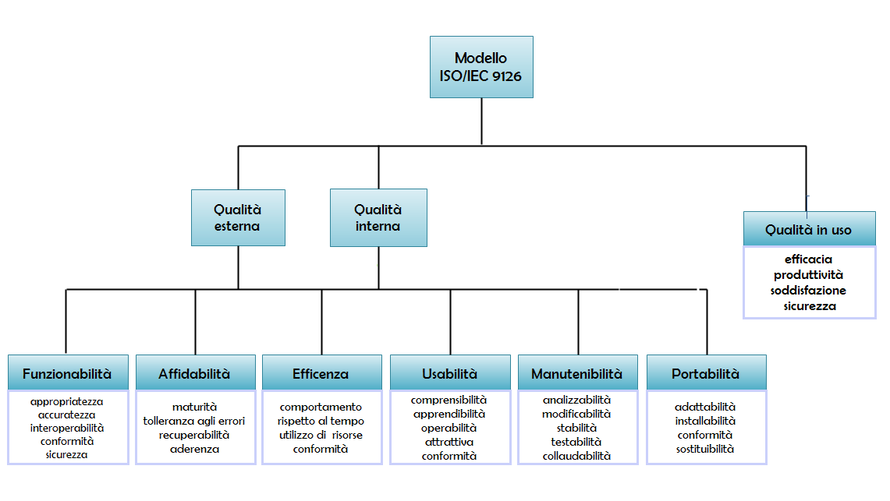

^ Scrivere codice in Word non è produttivo né soddisfacente

---

# Funzionalità

---

Nel momento in cui rilasciamo il software, prima che gli utenti lo vedano, la nostra app possiede le stesse proprietà del gatto di Schrödinger.

^
- Abbiamo oggi tanti strumenti e metodologie per evitare ciò
- Il coraggio di mandare a cagare Schrödinger

---

[.hide-footer]
[.slidenumbers: false]


---

# Testing

[.footer: Affidabilità]

- Perché testare? [Assert(JS) Conf 2018](https://www.youtube.com/playlist?list=PLZ66c9_z3umNSrKSb5cmpxdXZcIPNvKGw)
- Come convincere i vostri manager [But it sucks!](https://youtu.be/zqdCM8zR6Mc?t=46m34s)

^ Farò finta di non sapere quanti di voi testano

---

# Testing

1. Unit tests
2. Integration tests
3. e2e/system tests

^ Il testing non è una metrica ma ci permette di averne

---

# Testing

[.footer: Funzionalità]

1) Unit tests: **Karma/Jest**
  
[Testing Angular with Jest](https://www.xfive.co/blog/testing-angular-faster-jest/)

^ Testano l'aspettativa dello sviluppatore

---


---

# Testing

[.footer: Funzionalità]

2) Integration tests

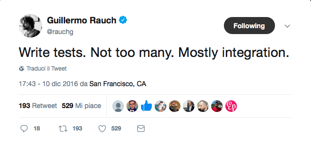

[Write mostly integration tests](https://blog.kentcdodds.com/write-tests-not-too-many-mostly-integration-5e8c7fff591c)

---

# Testing

[.footer: Funzionalità]

3) e2e/system tests: **Protractor/Cypress**

[Cypress with Angular & Typescript](https://www.cypress.io/blog/2017/12/11/an-alternative-to-protractor-for-angular-projects/#Cypress-tests)

^ Testano l'aspettativa dell'utente

---


---

[.hide-footer]
[.slidenumbers: false]

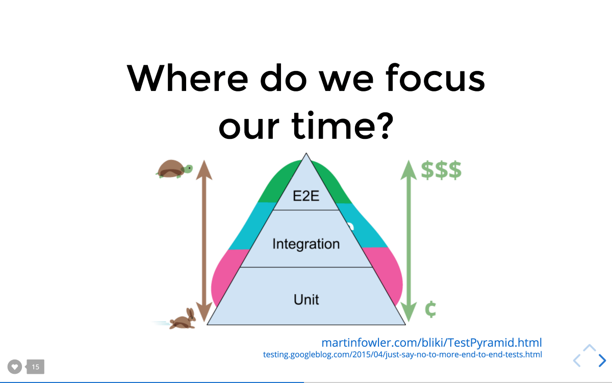

^ Avere un errore a livello e2e equivale anche a livello unit

---


# QA

Anche una buona Quality Assurance **non** rileva tutti gli errori e sempre

---

# Consigli per il testing

- Minimizzare l'API ~~chai/sinon~~
- Minimizzare la curva di apprendimento
- Non deve spaventare a prima vista

---

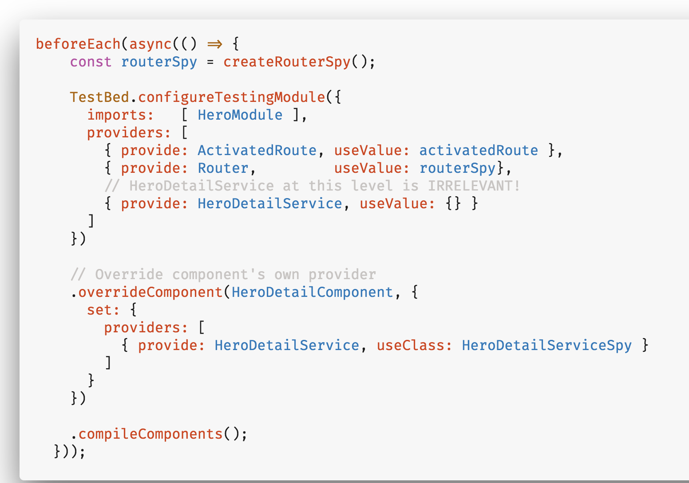

^ Per non parlare di marble testing

---

# Affidabilità

---

# Affidabilità

- Testing (again)
- Coverage

^ Capacità del prodotto software di portare a termine un compito secondo quanto previsto, anche di fronte a situazioni impreviste.

---

[.footer: Affidabilità]

> "Testing shows the presence, not the absence of bugs"
-- Dijkstra (1969)

^
- Un buon test è un test che fallisce
- Se fallisce deve fallire sempre (determinismo)

---

[.footer: Affidabilità]

# Coverage

- Istanbul
- Karma coverage/Jest

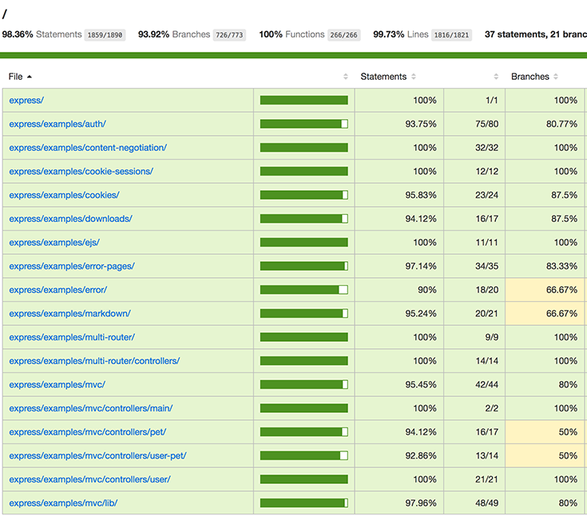

---

[.footer: Affidabilità]

# Coverage

**Statement** coverage
vs
**Branch** coverage

^
- La branch coverage assicura la copertura dei casi
- Dà anche una misura della complessità

---

# How much coverage?

---

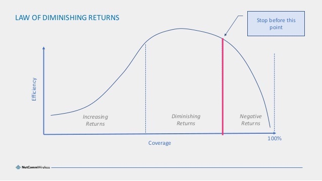

^ Dove sta il punto dipende dal progetto e dall'azienda

---

# Efficienza

^ Capacità di portare a termine i compiti usando un quantitativo di risorse temporali e di memoria adeguate

---

# Efficienza

- Complessità ciclomatica
- Indice Lighthouse
- Dimensione bundle

---

[.footer: Efficienza]

# Complessità ciclomatica

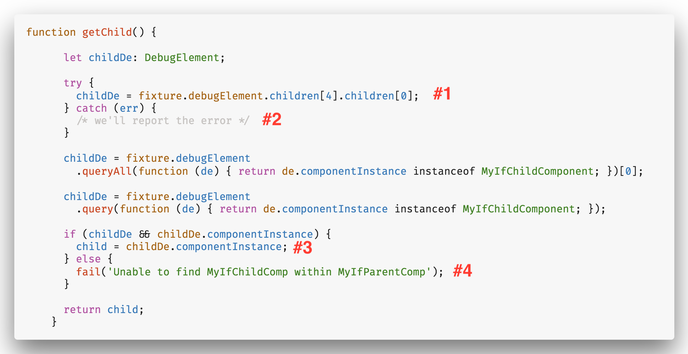

^
- Difficile da comprendere
- Error prone
- Cresce esponenzialmente con l'annidamento
- Aumenta la difficoltà della coverage
- Controllabile con linter

---

[.footer: Efficienza]

# Lighthouse


---

[.footer: Efficienza]

# Dimensioni bundle

[import-cost](https://github.com/wix/import-cost)

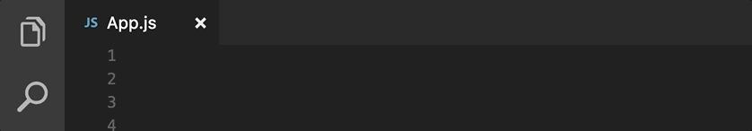

---

[.footer: Efficienza]

# Dimensioni bundle

[bundlesize](https://github.com/siddharthkp/bundlesize)

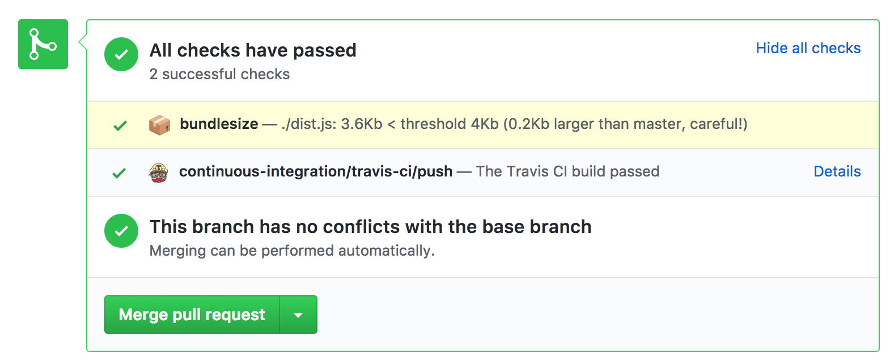

---

[.footer: Efficienza]

# Dimensioni bundle

[webpack-bundle-analyzer](https://github.com/webpack-contrib/webpack-bundle-analyzer)

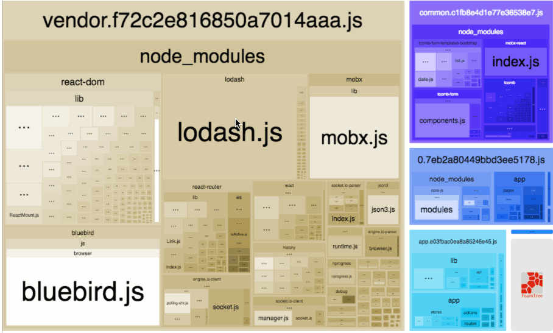

---

# Manutenibilità

^ Capacità nell’essere aperto alle modifiche nella maniera più intuitiva, immediata e sicura possibile

---

[.footer: Manutenibilità]

# TypeScript

- Strict configuration
- Conditional types

^
- Auto-documentazione
- Correttezza statica
- Concorre alla qualità, in maniera diversa dal testing

---

[.footer: Manutenibilità]

# Strict configuration

`--strict`

```json
{
  "noImplicitAny": true,
  "noImplicitThis": true,
  "alwaysStrict": true,
  "strictNullChecks": true,
  "strictFunctionTypes": true, // TS 2.6
  "strictPropertyInitialization": true // TS 2.7
}
```

---

[.footer: Manutenibilità]

# Conditional types (TS 2.9)

TS <= 2.8
`type AppState = Readonly<BaseAppState>`

TS >= 2.9
`type AppState = DeepReadonly<BaseAppState>`

---

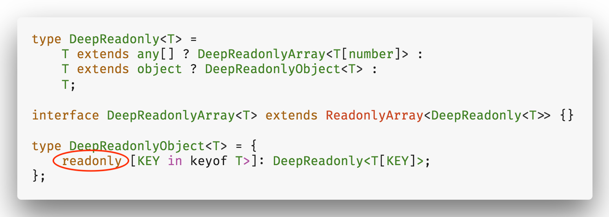

^
- Conditional types essenzialmente danno la possibilità di usare `if` nei tipi e fare domande a TS a livello di tipo

---

# ReturnType

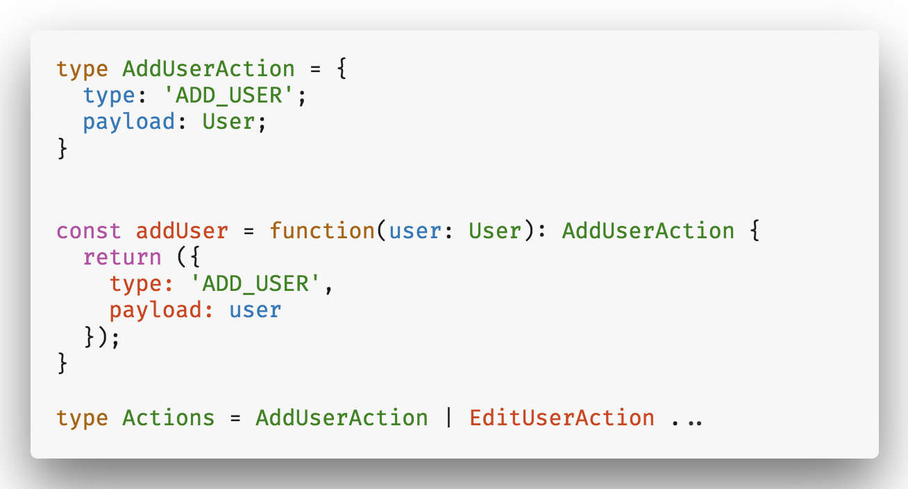

---

# ReturnType

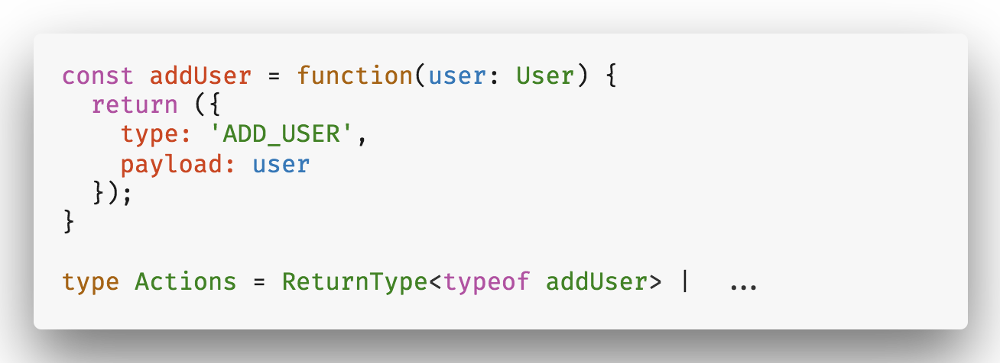

---

[.footer: Manutenibilità]

# Partial

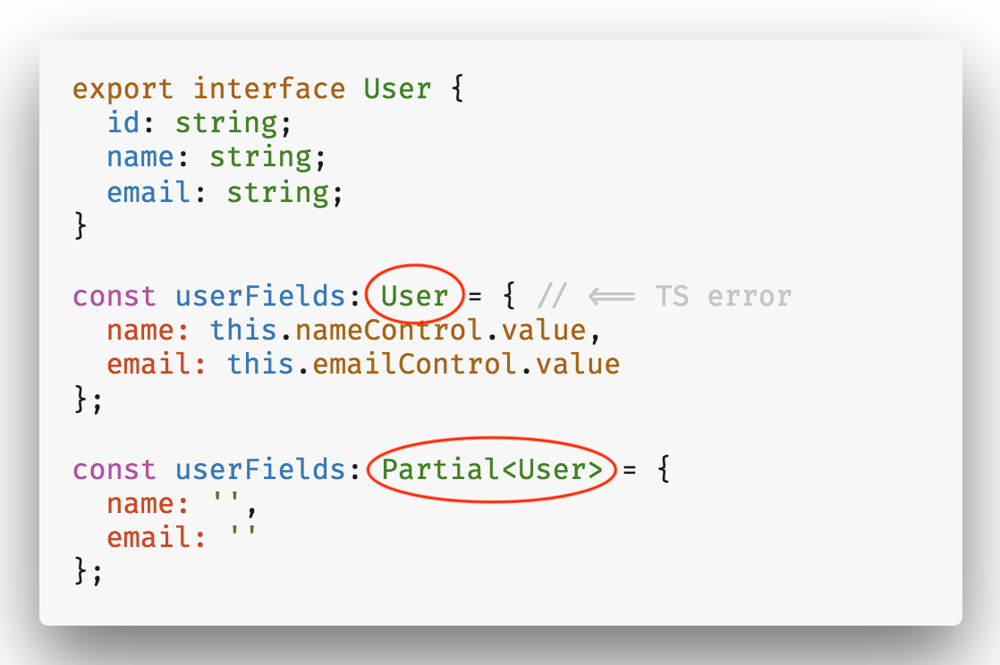

---

# Manutenibilità

- Complessità ciclomatica
- Profondità di annidamento
- Numero di parametri 
- Linee di codice per file
- Statement per funzione

--- 

# ESLint - Manutenibilità

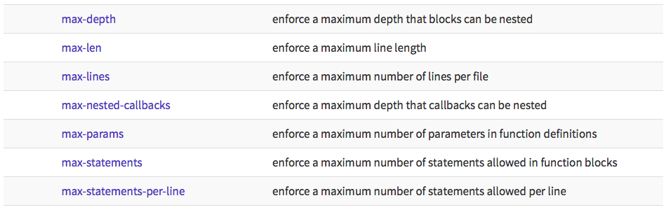

---

[.footer: Manutenibilità]

# Manutenibilità

[Plato](https://github.com/es-analysis/plato)

- Errori di implementazione Halstead
- Indice di manutenibilità

---

[.hide-footer]
[.slidenumbers: false]

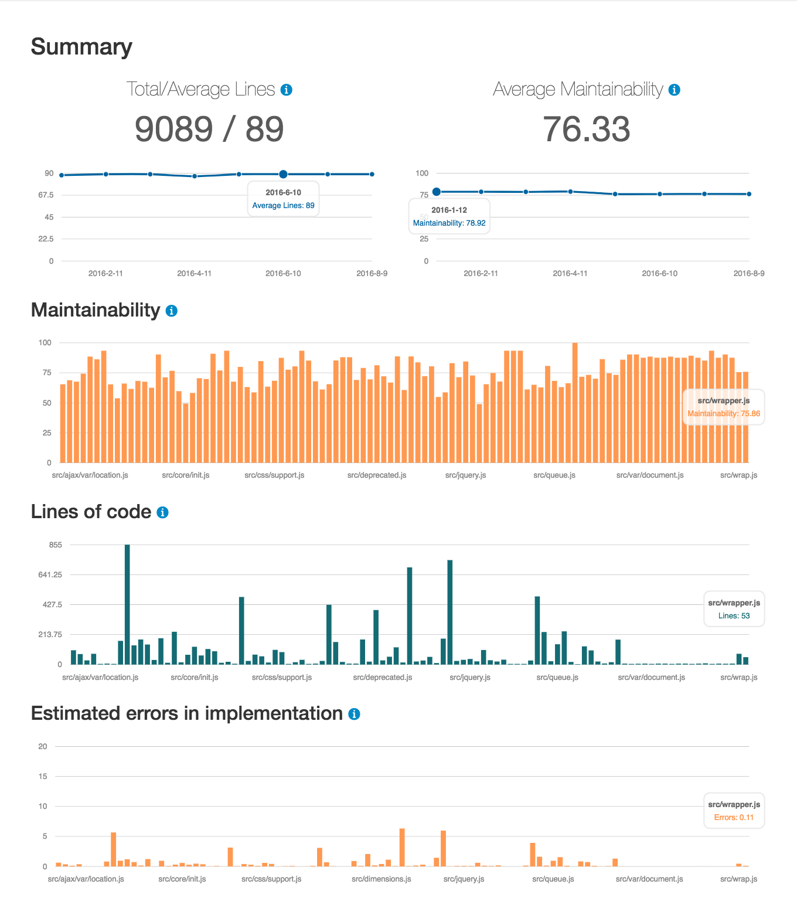

---

 ⚠️ 

No ES6/TS support 🙃

---

# Portabilità

^ Capacità di essere eseguito su ambienti/dispositivi diversi

---

# Portabilità

- **BrowserStack**
- **Sauce Labs**
- [eslint-plugin-compat](https://github.com/amilajack/eslint-plugin-compat)

---

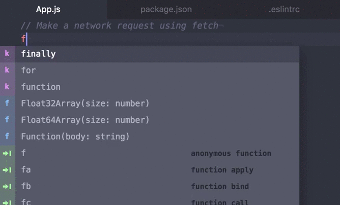

---

# Workflow

---

# Workflow - Before committing

1. Linter
2. Editor/IDE plugins
3. Git hooks

^ Ricordiamo che più andiamo avanti più è oneroso tornare indietro

---

# Workflow - After committing

1. Pull Requests 👈🏻 😎
2. Continuous Integration
3. Code review
4. Merge 🤞🏻

--- 

# 1. Pull Requests

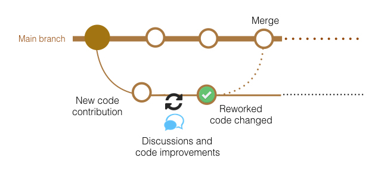

^
Alla PR ci si arriva già con alcune garanzie di correttezza, date dall'analisi statica e da linters/git hooks
Un'opportunità per condividere ed imparare

--- 

# 2. CI

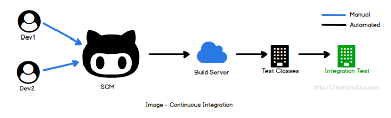

--- 

# 2. CI

1. L'applicazione deve compilare
2. Tutti i test devono passare
3. Tutte le metriche devono passare, ad esempio *bundlesize*

---

# 3. Code review

1. **Non** riguarda code style 
2. **Non** riguarda aspetti automatizzabili
3. Premiare ciò che è giusto
4. Opportunità per condividere ed imparare

^
- Chi impara non sbaglierà più e potrà segnalare gli stessi errori ad altri
- **Non** assumere che sia sbagliato

---

[.text: alignment(left)]

# 3. Code review

- Correttezza logica, design patterns, performance, sicurezza etc.
    - [Palantir - Code review best practises](https://medium.com/palantir/code-review-best-practices-19e02780015f)
- Analisi delle soluzioni adottate
- Fare una **checklist**

--- 

# I peccati devono essere pubblici

1. Build fallite
2. Notifiche Slack

---

# La qualità deve essere premiata

---

# Basta incentivare i comportamenti errati


---

# Conclusioni

- La qualità è uno sforzo continuo e collettivo
- Cultura della Qualità
- Community

^ Regola del boy-scout

---

# ...?

- What about Quality Assurance, Quality Management, Quality Control etc.?
- Qualità di Processo
- TDD

^
- Se uno lavora alle 2 di notte difficilmente produrrà qualità
- Ci sono diverse metodologie per lo sviluppo con qualità, ne parleremo in un altro talk

---

Maggior attenzione alla qualità e ricerca di misure per migliorarla

---

# Jiayi Hu

Front-end developer & consultant

- [https://github.com/jiayihu](https://github.com/jiayihu)
- [https://twitter.com/jiayi_ghu](@jiayi_ghu)
- [jiayi.ghu@gmail.com](jiayi.ghu@gmail.com)

---

A proposito di 
miglioramento continuo...

[https://joind.in/event/angular-day-2018](https://joind.in/event/angular-day-2018/the-pursuit-of-quality)
