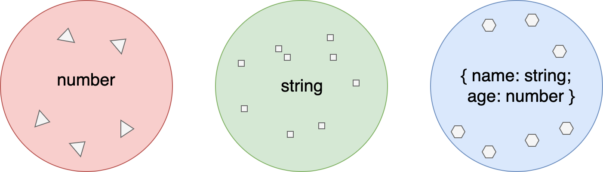
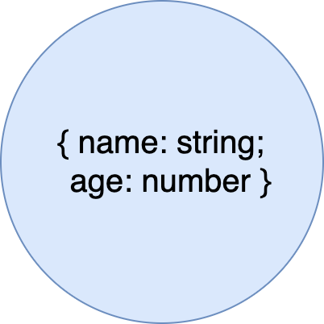
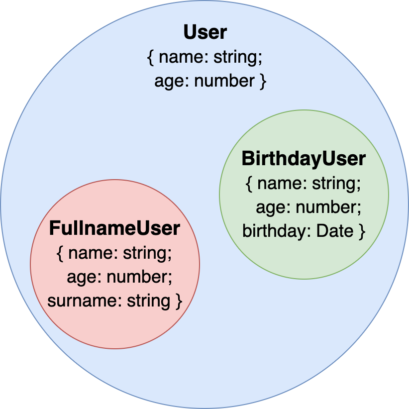
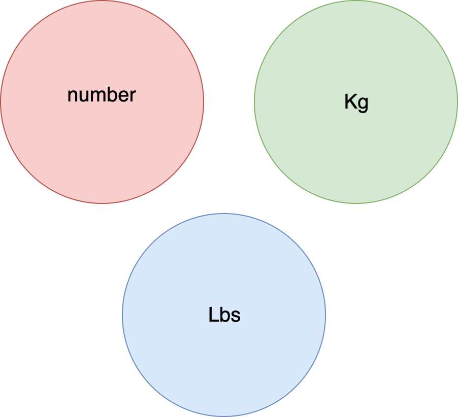
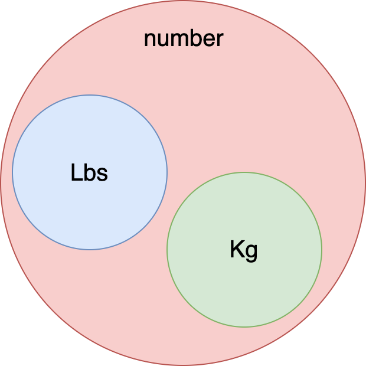
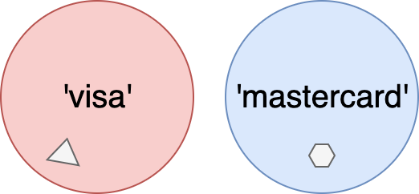
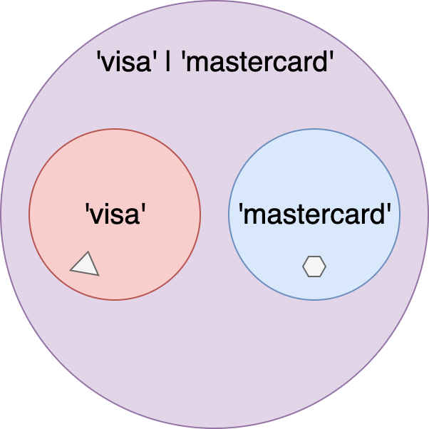
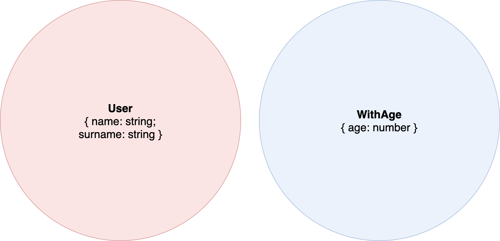
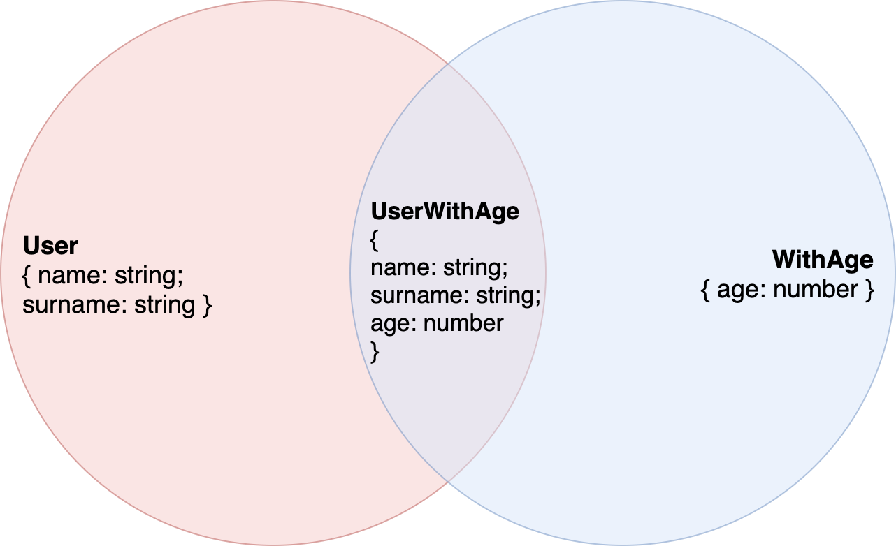
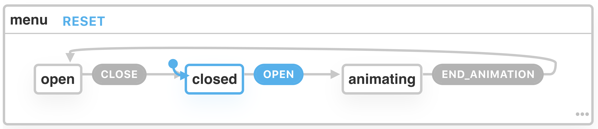

footer: Type-safer React & Redux applications
slidenumbers: true
slidecount: true


---

# Schedule of this talk

1. Introduction to TypeScript type-system
2. Modeling domain business logic
3. Modeling UI constraints
4. Better Redux typings

^ I'm a consultant

---

# TypeScript

- A superset of JavaScript, it adds a type system
- Compiles into a target ES version
- It has a powerful language server, built-in into VSCode
- [Open source from Microsoft](https://github.com/microsoft/TypeScript)


---

> A type defines the set of values a variable can take.

^ Do you remember sets from math classes

---



```typescript
const age: number = 23
const name: string = 'Jiayi'
const user: { name: string, age: number } =
  { name: 'Jiayi', age: 23 }
```

---



```typescript
type User = { name: string, age: number }

const user: User = { name: 'Jiayi', age: 23 }
```

---

# Structural subtyping



```typescript
type User = {
  name: string,
  age: number
}

const surnameUser: User = {
  name: 'Jiayi',
  age: 23,
  surname: 'Hu'
}

const birthdayUser: User = {
  name: 'Jiayi',
  age: 23,
  birthday: new Date()
}
```

^ if two types are **structurally** identical they are seen as compatible.

---

# Structural subtyping

```typescript
function isAdultUser(user: User): boolean {
  return user.age >= 18
}

isAdultUser(user) // Okay
isAdultUser(surnameUser) // Okay
isAdultUser(birthdayUser) // Okay
```

<!-- ---

# Multiple supertypes

```typescript
type WithBirthday = { birthday: Date }
const birthdayUser = { name: 'Jiayi', age: 23, birthday: new Date() }

const isAdultUser = (user: User): boolean => user.age >= 18

const isTodayBirthday = (birthday: WithBirthday): boolean => {
  return user.birthday.getDate() === new Date().getDate()
    && user.birthday.getMonth() === new Date().getMonth()
}

isAdultUser(birthdayUser) // Okay
isTodayBirthday(birthdayUser) // Okay
``` -->

---

# Origins

Types are important for compiled language: different types does not use the same memory.

^ the computer needs to be made aware of that to make sure it does not enter an invalid state during runtime.
What about not compiled languages like JavaScript?

---

# Two perspectives on type errors - 1

A discrepancy between differing data types e.g. treating an `string` as `number`.

- Usually the system terminates.

---

# Two perspectives on type errors - 2

A logic error: an erroneous or undesirable program behaviour, a contravention of the programmer's **explicit** intent

- The system does not terminate abnormally.

^ A program with a logic error is a valid program in the language, though it does not behave as intended.
^ The only clue to the existence of logic errors is the production of wrong solutions

---

[When NASA Lost a Spacecraft Due to a Metric Math Mistake](https://www.simscale.com/blog/2017/12/nasa-mars-climate-orbiter-metric/)


^ $125 million, 10 months of travel towards Mars

---

> `pounds` !== `kilograms`

^ Both are `number` for a compiler or interpreter

---

```typescript
// Force is also needed in real life
function getAcceleration(mass: number): number {}

getAcceleration(1000) // lbs
getAcceleration(453.592) // Kg
```

---

# Functional Domain modeling

---

No talking about Monads.

---

# Types are **transparent** by default

```typescript
type Lbs = number
type Kg = number

function getAcceleration(mass: Kg): number {}

const massInKg: Kg = 453.592
const massInLbs: Lbs = 1000

getAcceleration(453.592) // Okay
getAcceleration(massInKg) // Okay
getAcceleration(massInLbs) // Still okay for TS
```

^ Transparency is fine for structural polimorphism
Typescript is not nominal

---

# Opaque types



---

# Opaque types

```typescript
// In real-life use readonly unique symbols
type Kg = { _tag: 'Kg' };
type Lbs = { _tag: 'Lbs' };

function getAcceleration(mass: Kg): number {}

const wrapAsKg = (value: number): Kg => value as any;
const wrapAsLbs = (value: number): Lbs => value as any;

const massInKg: Kg = wrapAsKg(453.592)
const massInLbs: Lbs = wrapAsLbs(1000)

getAcceleration(massInKg) // Okay
getAcceleration(453.592) // TS error
getAcceleration(massInLbs) // TS error
```

---

# Opaque types

```typescript
type Opaque<T> = { _tag: T };

type Kg = Opaque<'Kg'>;
type Lbs = Opaque<'Lbs'>;
```

---

# newtype-ts

```typescript
import { Newtype, iso } from 'newtype-ts'

interface Kg extends Newtype<{ Kg: unique symbol }, number> {}

const isoKg = iso<Kg>();

const massInKg: Kg = isoKg.wrap(453.592)

function getAcceleration(mass: Kg): number {}
```

---

[.build-lists: true]

```typescript
function isPositive(value: number): boolean {
  return value > 0
}
isPositive(massInKg) // TS error
```

```typescript
const value: number = iso.unwrap(massInKg)
isPositive(value) // Okay
```

---

# Branded types



---

# Branded types

```typescript
type Kg = number & { _tag: 'Kg' };
type Lbs = number & { _tag: 'Lbs' };

getAcceleration(massInKg) // ok
getAcceleration(massInLbs) // TS error

isPositive(massInKg) // Okay
```

---

# Branded types

```typescript
type Branded<K, T> = K & { _tag: T };

type Kg = Branded<number, 'Kg'>;
type Lbs = Branded<'number, Lbs'>;
```

<!-- ---

# Refined types

```typescript
import { Newtype, prism } from 'newtype-ts'

interface Kg extends Newtype<
  { readonly Kg: unique symbol }, number> {}

const isKg = (n: number): boolean => n > 0

const prismKg = prism<Kg>(isKg)

const oCard: Option<Kg> = prismKg.getOption(119)
```

---

# Option

```ts
type Option<A> =
  | { type: 'None' }
  | {
      type: 'Some',
      value: A
    }
``` -->

---


---

```typescript
export type ShippingAddress = {
  name: string;
  street: string;
  city: string;
  postalCode: string;

  isPickup: boolean;
  pickupCompany?: string;
};

export type PaymentMethod = {
  paymentMethod: string;
  cardNumber: string;
  cardExpiration: string;
  cardCode: string;
};
```

---

[.code-highlight: 7-8, 12]

```typescript
export type ShippingAddress = {
  name: string;
  street: string;
  city: string;
  postalCode: string;

  isPickup: boolean;
  pickupCompany?: string;
};

export type PaymentMethod = {
  paymentMethod: string;
  cardNumber: string;
  cardExpiration: string;
  cardCode: string;
};
```

---

# Literal types



```typescript
const visa: 'visa' = 'visa'
const mastercard: 'mastercard' = 'mastercard'
```

^ Always have the smallest set possible

---

# Union types / Sum types



```typescript
type PaymentMethod = 'visa' | 'mastercard'
```

---

# Intersection types



```typescript
type User = { name: string, surname: string }
type WithAge = { age: number }
```

---

# Intersection types



```typescript
type UserWithAge = User & WithAge
```

---

# Sum types - Avoid invalid states

```ts
type CommonInfo = {
  name: string;
  street: string;
  city: string;
  cap: string;
}

type SendToHome = CommonInfo & { type: 'SendToHome' }

type SendToPickupPoint = CommonInfo & 
  { type: 'SendToPickupPoint', company: string }

type ShippingAddress = SendToHome | SendToPickupPoint
```

^ type is called discriminant property

---

# Type narrowing

```ts
function handleShipping(address: ShippingAddress) {
  // typeof address.type === 'SendToHome' | 'SendToPickupPoint'
  console.log(address.company) // TS Error

  if (address.type === 'SendToHome') {
    // typeof address.type === 'SendToHome'
    console.log(address.company) // TS Error
    return;
  }

  // typeof address.type === 'SendToPickupPoint'

  if (address.type === 'SendToPickupPoint') {
    console.log(address.company) // Okay and with autocomplete
    return;
  }

  // typeof address.type === never
}
```

---

# Pattern matching [^1]

```ts
function handleShipping(address: ShippingAddress) {
  console.log(address.company) // TS Error

  switch (address.type) {
    case 'SendToHome':
      console.log(address.company) // TS Error
      return;
    case 'SendToPickupPoint':
      console.log(address.company) // Okay and with autocomplete
      return;
    // No default case
  }
}
```

[^1]: [tc39/proposal-pattern-matching](https://github.com/tc39/proposal-pattern-matching)

^ Exhaustive type checking

---

```ts
type SendToHome = CommonInfo
  & { type: 'SendToHome' }

type SendToPickupPoint = CommonInfo & {
  type: 'SendToPickupPoint',
  company: string
}

type SendToAmazonLocker = CommonInfo & {
  type: 'SendToAmazonLocker',
  code: string
}

type Pickup =
  | SendToHome
  | SendToPickupPoint
  | SendToAmazonLocker
```

^ By using sum types we can model relationship between models and domain constraints

---

[.code-highlight: 3-9]

```ts
function handleShipping(address: ShippingAddress) {
  switch (address.type) {
    case 'SendToHome':
      console.log(address.company)
      return;
    case 'SendToPickupPoint':
      console.log(address.company)
      return;
    // TS Error, missing 'SendToAmazonLocker' case
  }
}
```

---


```ts
type CardType = 'Visa' | 'Mastercard'
type CardPayment = {
  type: 'CardPayment';
  card: CardType;
  cardNumber: string;
  cardExpiration: string;
  cardCode: string;
};

type CashPayment = {
  type: 'CashPayment';
}

type ChequePayment = {
  type: 'ChequePayment';
}

export type PaymentMethod = CardPayment | CashPayment | ChequePayment
```

^ Ubiquitous language

<!-- ---

```typescript
function render(payment: PaymentMethod) {
  switch (payment.type) {
    case 'CardPayment':
      return renderCardPayment(payment)
    case 'CashPayment':
      return renderCashPayment(payment)
    case 'ChequePayment':
      return renderChequePayment(payment)
  }
}
```

```typescript
function renderCardPayment(cardPayment: CardPayment)
  : React.ReactElement {}
``` -->

---

# UI State

Make illegal states unrepresentable

---

```typescript
type Props = {
  placeholder?: string;

  isMultiple?: boolean;
  value: string | string[];
  onChange: (value: string | string[]) => void;
}

class Select extends React.Component<Props> {}
```

^ Model relationship between properties

---

```typescript
<Select
  value={['Ocean', 'Blue']} // Missing 'isMultiple' prop
  onChange={onChange}
/>

<Select
  isMultiple
  value="Ocean" // Should be an array
  onChange={onChange}
/>

<Select
  value="Ocean"
  onChange={(value: string | string[]) => {
    return value.toUpperCase() // TS Error
  }}
/>
```

---

```typescript
type SingleValueProps = {
  placeholder?: string;
  value: string;
  onChange: (value: string) => void;
}

type MultipleValuesProps = {
  placeholder?: string;
  isMultiple: true;
  value: string[];
  onChange: (value: string[]) => void;
}

type Props = SingleValueProps | MultipleValuesProps
```

---

```typescript
<Select
  value={['Ocean', 'Blue']} // TS Error
  onChange={onChange}
/>

<Select
  isMultiple
  value="Ocean" // TS Error
  onChange={onChange}
/>

<Select
  value="Ocean"
  onChange={value => value.toUpperCase()} // Okay
/>
```

---

```typescript
type CartMenuState = {
  isOpen: boolean;
  isAnimating: boolean;
  positionX: number;
}
```

^ Using booleans for state can be problematic

---

```typescript
type OpenState = { type: 'Open' }
type ClosedState = { type: 'Closed' }
type AnimatingState = { type: 'Animating', positionX: number }

type CartMenuState = OpenState | ClosedState | AnimatingState
```

---

```typescript
export class CardMenu extends React.Component<{}, CardMenuState> {
  handleOpen = () => {
    this.setState({ type: 'Animating', positionX: 0 })
  }

  handleAnimating = () => {
    if (this.state.type === 'Animating') {
      this.setState({ positionX: this.state.positionX + 10 })
    }
  }

  handleAnimationEnd = () => this.setState({ type: 'Closed' })

  render() {
    ...
  }
}
```
<!-- 
---

```typescript
export class CardMenu extends React.Component<{}, CardMenuState> {
  render() {
    switch (this.state.type) {
      case 'Open':
        return this.renderOpen();
      case 'Closed':
        return this.renderClosed();
      case 'Animating':
        return this.renderAnimating();
    }
  }
}
``` -->

---

# Finite state machine



---

# Use cases for Sum types in React

- Drag & Drop
- Editable components
- [Render props](https://dev.to/busypeoples/notes-on-typescript-render-props-1f3p)

---

# Type narrowing Redux actions

```typescript
type LoginAction = {
  type: 'LOGIN_USER',
  payload: { username: string, role: string }
};
type LogoutAction = { type: 'LOGOUT_USER' };
type OtherActions = { type: '__OTHER_ACTIONS__' }

type Action = 
  | LoginAction
  | LogoutAction
  | OtherActions
```

---

# Type narrowing Redux actions

```typescript
function reducer(state: State = initialState, action: Action) {
  switch (action.type) {
    case 'LOGIN_USER':
      return { ...state, username: action.payload.username }
    case 'LOGOUT_USER':
      return { ...state, username: action.payload.username } // TS error
    default:
      return state
  }
}
```

^ Ensure cases are valid action types
Narrowing action type
Warning about missing default

---

# Conclusion

- Opaque/Branded types
- Intersection types
- Sum types
- Type refinements (What if the mass is a negative number?)
- Phantom types

---

# Homework

1. Try to solve the same issues with OOP
2. Type checking and unit/integration testing

---

# Jiayi Hu

## Front-end consultant, based at Padova (IT).

---

Twitter: [@jiayi_ghu](https://twitter.com/jiayi_ghu)

Slides: [github.com/jiayihu/talks](github.com/jiayihu/talks)

---


<!-- ---

# Design-by-contract programming

Extend the ordinary definition of abstract data types with **preconditions, postconditions and invariants**

---

What does the contract expect?
What does the contract guarantee?
What does the contract maintain?

---

Many programming languages have facilities to make assertions like these.

- [Ada pragma Assertion_Policy](https://learn.adacore.com/courses/intro-to-ada/chapters/contracts.html)
- [Rust Hoare](https://crates.io/crates/hoare)

# assert

^ Checked only in development, removed at runtime

---

# Relation to testing

- Type safety does not replace unit testing or integration testing
- Tests run against one specific value, type invariants talk about sets of values

^ Rather, it complements external testing.

---

> Testing talks about the **presence** of defects and don’t talk about the **absence** of defects.

---

> Type systems can formally guarantee the compliance of invariants. -->
